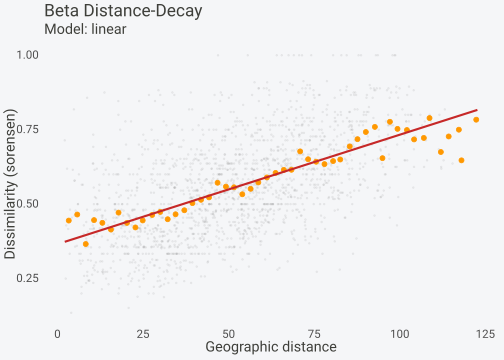
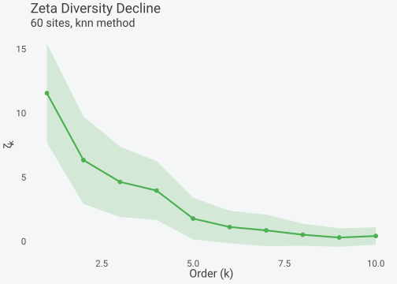
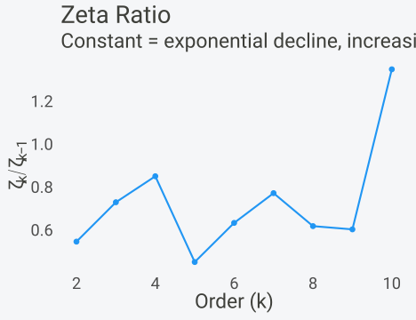
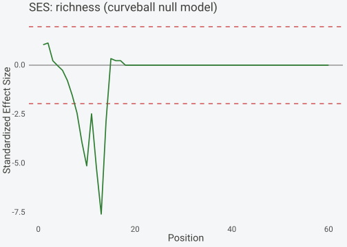
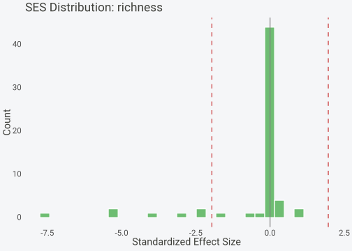

# Community Assembly and Turnover

## Overview

Understanding how communities change across space requires tools that
quantify turnover at different scales. **spacc** provides three
complementary approaches:

1.  **Beta distance-decay**: How does compositional similarity decay
    with distance?

2.  **Zeta diversity**: How does the number of shared species change
    with the number of sites compared?

3.  **SES null models**: Are observed patterns different from random
    expectations?

## Data setup

``` r

library(spacc)
set.seed(123)

n_sites <- 60
coords <- data.frame(
  x = runif(n_sites, 0, 100),
  y = runif(n_sites, 0, 100)
)

# Spatially structured community:
# species occurrence probability decays with distance from species' "center"
n_species <- 25
species <- matrix(0, nrow = n_sites, ncol = n_species)
centers_x <- runif(n_species, 0, 100)
centers_y <- runif(n_species, 0, 100)

for (sp in seq_len(n_species)) {
  dists <- sqrt((coords$x - centers_x[sp])^2 + (coords$y - centers_y[sp])^2)
  prob <- exp(-dists / 30)
  species[, sp] <- rpois(n_sites, lambda = prob * 3)
}
colnames(species) <- paste0("sp", seq_len(n_species))

# Build accumulation curve (used later for SES null models)
sac <- spacc(species, coords, n_seeds = 10, progress = FALSE)
```

## Beta distance-decay

The
[`betaDecay()`](https://gillescolling.com/spacc/reference/betaDecay.md)
function fits models to the relationship between compositional
dissimilarity and geographic distance:

``` r

decay <- betaDecay(species, coords)
#> ℹ Computing distance matrix
#> ℹ Computing 1,770 pairwise dissimilarities (sorensen)
#> ℹ Fitting decay models
#> ✔ Done
plot(decay)
```



``` r

summary(decay)
#> $n_sites
#> [1] 60
#> 
#> $n_pairs
#> [1] 1770
#> 
#> $distance_range
#> [1]   2.133552 122.675695
#> 
#> $dissimilarity_range
#> [1] 0.1351351 1.0000000
#> 
#> $mean_dissimilarity
#> [1] 0.5569438
#> 
#> $coefficients
#>                    model         a           b        AIC
#> a            exponential 0.6639603 0.008131670 -1925.4191
#> (Intercept)        power 0.2005184 0.256130232   481.6219
#> (Intercept)1      linear 0.3656503 0.003674776 -1943.9352
#> 
#> $best_model
#> [1] "linear"
#> 
#> $half_life
#> [1] 85.24045
#> 
#> $index
#> [1] "sorensen"
```

## Zeta diversity

Zeta diversity measures the number of species shared among exactly
\\\zeta\\ sites. The rate of decline from \\\zeta_1\\ to higher orders
indicates whether turnover is driven by common or rare species:

``` r

zd <- zetaDiversity(species, coords, orders = 1:10, n_samples = 50)
#> ℹ Computing distance matrix
#> ℹ Computing zeta diversity (orders 1-10, knn)
#> ✔ Done
plot(zd)
```



The ratio plot reveals whether turnover follows an exponential
(stochastic) or power-law (niche-driven) pattern:

``` r

plot(zd, type = "ratio")
```



## SES null models

Standardized effect sizes compare observed diversity patterns against
null expectations. A positive SES indicates higher diversity than
expected (overdispersion); negative SES indicates clustering.

``` r

result <- ses(sac, species, coords,
              null_model = "curveball", n_perm = 19,
              progress = FALSE)
print(result)
#> Standardized Effect Size (SES)
#> ------------------------------------ 
#> Input class: spacc
#> Metric: richness
#> Null model: curveball (19 permutations)
#> SES range: [-5.62, 0.47]
#> Mean SES: -0.51
#> Significant (p < 0.05): 0 / 60 values (0%)
```

``` r

plot(result, type = "curve")
```



The histogram shows the distribution of SES values across accumulation
steps:

``` r

plot(result, type = "histogram")
```



## Combining the three approaches

These tools answer complementary questions:

| Approach | Question | Key output |
|----|----|----|
| Distance-decay | How fast does similarity decline? | Decay rate, half-distance |
| Zeta diversity | Common vs. rare species turnover? | Decline ratio, power/exp fit |
| SES null models | Is the pattern non-random? | SES values, p-values |

Together they provide a comprehensive view of community assembly
mechanisms operating in the study region.

## References

- Baselga, A. (2010). Partitioning the turnover and nestedness
  components of beta diversity. *Global Ecology and Biogeography*, 19,
  134-143.
- Hui, C. & McGeoch, M.A. (2014). Zeta diversity as a concept and metric
  that unifies incidence-based biodiversity patterns. *American
  Naturalist*, 184, 684-694.
- Strona, G., Nappo, D., Boccacci, F., Fattorini, S. &
  San-Miguel-Ayanz, J. (2014). A fast and unbiased procedure to
  randomize ecological binary matrices with fixed row and column totals.
  *Nature Communications*, 5, 4114.
