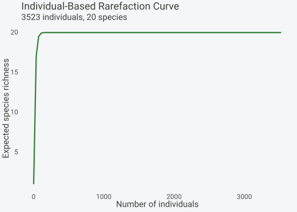
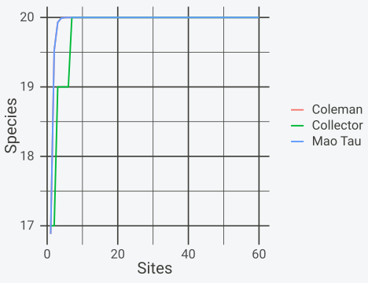
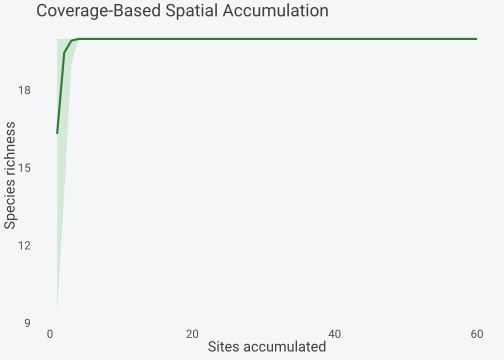
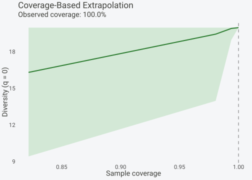
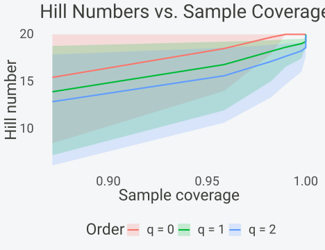
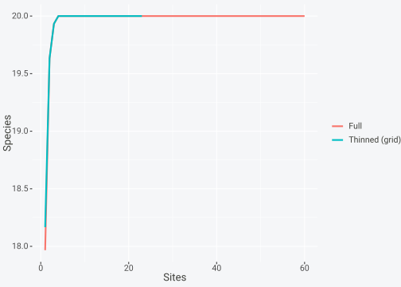

# Rarefaction and Standardization

## Introduction

Species richness counted from raw data confounds two things: how diverse
a community is and how hard it was sampled. A plot visited for an
afternoon yields fewer species than the same plot visited for a week,
even though the underlying community has not changed. The same effect
appears across sites. A site with 500 recorded individuals will, on
average, show more species than a neighbour with 50, because more
individuals expose more of the rare tail of the community. Any
comparison of raw counts therefore partly measures effort rather than
ecology.

The bias is large. Richness rises steeply with the first few dozen
individuals and only flattens once the common species are saturated and
new records start repeating species already seen. Two sites at different
points on that rising curve are not comparable. Reporting that site A
has 18 species and site B has 11 says little until both numbers refer to
the same amount of sampling.

Standardization removes the effort axis so that the diversity axis can
be read on its own. Two families of methods do this. Rarefaction fixes a
common sample size and asks how many species would be expected at that
size. Coverage-based methods fix a common completeness, the fraction of
total community abundance that the observed species account for, and
compare richness at that shared completeness. This vignette develops
both, shows the estimators **spacc** provides for each, and ends with
concrete rules for choosing between them. The running theme is that the
standardization target, equal size or equal coverage, can change which
site looks more diverse.

The distinction matters because size and coverage are not
interchangeable. A fixed number of individuals corresponds to very
different completeness depending on how even the community is. In an
even community a few hundred individuals already capture almost every
species, so coverage is high. In a community with a handful of dominants
and a long tail of rare species, the same few hundred individuals leave
much of the tail undetected, so coverage stays low. Comparing two such
communities at equal sample size therefore compares them at unequal
completeness, which reintroduces a version of the bias that rarefaction
was meant to remove. Coverage-based standardization closes that gap by
making completeness itself the common currency.

The cost of coverage standardization is that it needs counts of
individuals. The singleton and doubleton frequencies that drive the
coverage estimate exist only in abundance data, not in presence/absence
records. When the data are binary, or when effort varies through the
number of plots rather than the number of individuals within a plot, the
sample-based rarefaction family is the right tool instead. **spacc**
carries all three families, and the sections below show how to move
between them on a single simulated dataset where the true community is
known.

## Methods and theory

### Individual-based rarefaction

Individual-based rarefaction asks a counterfactual question. Given a
pooled sample of \\N\\ individuals containing \\S\_{obs}\\ species, how
many species would be expected in a random subsample of \\n \le N\\
individuals drawn without replacement. Hurlbert (1971) gives the exact
expectation. Let \\N_i\\ be the total abundance of species \\i\\, so
that \\N = \sum_i N_i\\. The probability that species \\i\\ appears at
least once in a subsample of \\n\\ is one minus the probability of
drawing \\n\\ individuals that all avoid species \\i\\:

\\ P(\text{species } i \in \text{subsample}) = 1 - \frac{\binom{N -
N_i}{n}}{\binom{N}{n}}. \\

Summing detection probabilities over all observed species gives the
expected rarefied richness, since the expectation of a sum of indicators
is the sum of their probabilities:

\\ E\[S_n\] = \sum\_{i=1}^{S\_{obs}} \left\[ 1 - \frac{\binom{N -
N_i}{n}}{\binom{N}{n}} \right\]. \\

Here \\E\[S_n\]\\ is expected richness at subsample size \\n\\, \\N\\ is
the total number of individuals pooled across the sites being compared,
\\N_i\\ is the abundance of species \\i\\, and \\S\_{obs}\\ is the
number of species observed in the full pooled sample. The curve
\\E\[S_n\]\\ starts at 1 when \\n = 1\\, rises monotonically, and
reaches \\S\_{obs}\\ exactly when \\n = N\\. The formula is computed on
a log scale in **spacc** to avoid overflow in the binomial coefficients.

The expectation is exact, not a simulation average. Drawing many random
subsamples of size \\n\\ and averaging their richness would converge to
\\E\[S_n\]\\, but the Hurlbert formula gives that limit in closed form,
which is both faster and free of Monte Carlo noise. The shape of the
curve carries information of its own. A curve that has flattened by \\n
= N/2\\ indicates a community whose common species are saturated, so
doubling the remaining effort would add few species. A curve still
rising steeply at \\n = N\\ indicates an undersampled community where
the species total is an underestimate. **spacc** attaches a bootstrap
interval to the curve by resampling individuals with replacement and
recomputing the expectation, which captures sampling variation in the
underlying frequencies.

The same logic extends to Hill numbers of order \\q\\, which weight
species by abundance. Order \\q = 0\\ is richness, where all species
count equally and the rare tail dominates. Order \\q = 1\\ is the
exponential of Shannon entropy, which weights species by their
frequency. Order \\q = 2\\ is the inverse Simpson concentration,
dominated by the common species. The Hill number of order \\q\\ of a
community with relative abundances \\p_i\\ is

\\ {}^{q}D = \left( \sum\_{i=1}^{S} p_i^{q} \right)^{1/(1-q)}, \qquad q
\ne 1, \\

with the \\q = 1\\ case taken as the limit \\{}^{1}D = \exp(-\sum_i p_i
\log p_i)\\. Each \\{}^{q}D\\ is an effective number of species, the
count of equally abundant species that would give the same diversity
value. Higher \\q\\ down-weights rare species, so the rarefaction curve
for \\q = 2\\ saturates faster and is far less sensitive to subsample
size than the curve for \\q = 0\\.

The choice of \\q\\ encodes a research question rather than a technical
preference. Richness (\\q = 0\\) treats a species seen once and a
species seen a thousand times as equal contributions, which makes it the
most sensitive to sampling effort and to the rare tail. Shannon
diversity (\\q = 1\\) weights each species by its abundance, giving a
balanced summary that is less affected by the few rarest records.
Inverse Simpson (\\q = 2\\) is governed almost entirely by the common
species and barely moves as effort grows, which makes it a stable
comparison when the rare tail is suspected to be noise. Scanning \\q\\
from 0 upward across the same data traces a diversity profile, and the
steepness of that profile is itself a measure of how uneven the
community is.

### Sample coverage

Sample size is a poor common currency when communities differ in
evenness. A fixed number of individuals can represent a near-complete
census of an even community yet barely scratch a community with a long
rare tail. Sample coverage measures completeness directly. Coverage
\\C\\ is the fraction of the total community abundance belonging to the
species already observed, so \\1 - C\\ is the probability that the next
individual sampled belongs to a species not yet recorded. Chao and Jost
(2012) estimate it from the frequency counts of the sample:

\\ C = 1 - \frac{f_1}{N} \cdot \frac{(N-1) f_1}{(N-1) f_1 + 2 f_2}. \\

Here \\f_1\\ is the number of singletons, species represented by exactly
one individual in the pooled sample, \\f_2\\ is the number of
doubletons, species represented by exactly two individuals, and \\N\\ is
the total number of individuals. The estimator rests on the Good-Turing
insight that singletons carry the signal about undetected species: many
singletons relative to doubletons means the rare tail is poorly sampled
and coverage is low. When \\f_1 = 0\\ every observed species has been
seen more than once, the correction vanishes, and \\C = 1\\.
Coverage-based rarefaction interpolates richness or any \\{}^{q}D\\ to a
target coverage rather than a target sample size, so two communities are
compared at equal proportional representation.

The deficit \\1 - C\\ has a direct reading as a probability. It
estimates the chance that the next individual sampled belongs to a
species not yet on the list, so it answers the practical question of how
much new information one more sample would bring. A deficit of 0.05
means coverage of 0.95, and the next individual has roughly a
one-in-twenty chance of being a new species. This interpretation is what
makes coverage a fair common currency: two samples at the same deficit
have the same residual probability of discovery, regardless of how many
individuals each took to reach that point. For plot-based spatial data,
where the sampling unit is a site rather than an individual, the Chiu
(2023) variant uses incidence frequencies, the counts of species found
in exactly one or two sites, and is the more appropriate estimator.
[`spaccCoverage()`](https://gillescolling.com/spacc/reference/spaccCoverage.md)
exposes both through its `coverage` argument.

## Simulating uneven effort

The simulation idiom from the package, a site-by-species matrix of
Poisson abundances, makes the effort bias concrete because the ground
truth is known. Here every site is drawn from the same 20-species pool,
so the true per-site richness ceiling is identical across all sites.
What differs is the Poisson rate, which sets per-site total abundance.
Low-rate sites are sampled shallowly and will miss species purely
because few individuals were drawn.

Building the matrix this way separates the two things real data
conflate. The biological signal, the species pool, is held fixed at 20
species for every site. The sampling signal, the per-site rate
\\\lambda\\, is varied deliberately across three tiers. Any difference
in observed richness between tiers is therefore attributable to effort
alone, because the generating community is identical. This is the
controlled setting in which a standardization method can be checked: a
method that works should erase the between-tier difference, recovering
the shared 20-species ceiling, while a method that fails will leave the
effort gradient intact. Real surveys never come with this guarantee,
which is why a simulation with known truth is the right place to build
intuition before applying the same tools to field data.

``` r

library(spacc)
set.seed(42)

n_sites <- 60
coords <- data.frame(x = runif(n_sites), y = runif(n_sites))

# Variable total abundances across sites (realistic uneven sampling)
lambdas <- rep(c(1, 3, 5), each = 20)
species <- matrix(0, nrow = n_sites, ncol = 20)
for (i in seq_len(n_sites)) {
  species[i, ] <- rpois(20, lambda = lambdas[i])
}
colnames(species) <- paste0("sp", 1:20)
```

The three effort tiers, Poisson rates 1, 3, and 5, span a fivefold range
in expected individuals per site. The induced bias is visible directly
in the per-site counts: low-effort sites record fewer individuals and
fewer species, even though all sites share the same underlying
community.

``` r

tier <- factor(lambdas)
indiv <- rowSums(species)
rich <- rowSums(species > 0)
aggregate(cbind(individuals = indiv, richness = rich), list(tier = tier), mean)
#>   tier individuals richness
#> 1    1       18.45    11.80
#> 2    3       59.65    18.95
#> 3    5       98.05    19.90
```

Mean observed richness climbs from the low-effort tier to the
high-effort tier despite an identical 20-species ceiling. That gap is
the artefact standardization is built to remove. A naive ranking of
these sites by raw richness would simply recover the sampling-effort
gradient.

The mean individuals per site track the Poisson rates closely, around
one, three, and five times 20 species, since each cell of the matrix is
an independent Poisson draw. Mean richness rises with them, but more
slowly, because the high tiers are already close to the 20-species
ceiling and have little room left to climb. The low tier sits far below
the ceiling, missing several species per site purely because few
individuals were drawn. This is the saturating-curve effect seen at the
level of a single site: the first individuals reveal common species
quickly, and each additional individual is progressively more likely to
repeat a species already recorded.

## Individual-based rarefaction

The [`rarefy()`](https://gillescolling.com/spacc/reference/rarefy.md)
function takes the abundance matrix, pools it across sites, and returns
the Hurlbert expectation \\E\[S_n\]\\ over a grid of subsample sizes.
The returned `spacc_rare` object carries the curve, a bootstrap standard
deviation, and 95 percent bounds.

``` r

# Rarefy to the pooled abundance grid (q = 0, richness)
rare <- rarefy(species)
print(rare)
#> Individual-based rarefaction
#> ---------------------------- 
#> Total individuals: 3523
#> Observed species: 20
#> Bootstrap replicates: 100
```

The numeric curve is recovered with
[`as.data.frame()`](https://rdrr.io/r/base/as.data.frame.html), which
exposes the sample sizes, the expected diversity, and the bootstrap
interval. The expectation flattens well before the full sample size, the
signature of a saturating community.

``` r

rare_df <- as.data.frame(rare)
head(rare_df, 4)
#>     n expected           sd    lower    upper
#> 1   1  1.00000 2.294488e-15  1.00000  1.00000
#> 2  37 17.00820 1.577237e-02 16.94641 17.00393
#> 3  72 19.50629 1.006188e-02 19.46492 19.50324
#> 4 108 19.92306 3.648140e-03 19.90731 19.92184
tail(rare_df, 2)
#>        n expected sd lower upper
#> 99  3487       20  0    20    20
#> 100 3523       20  0    20    20
```

``` r

plot(rare) + transparent
```



Rarefaction at higher orders down-weights the rare species. Passing
`q = 1` and `q = 2` returns the Shannon and Simpson effective numbers,
which saturate faster because they are governed by the common species
rather than the long tail.
[`rarefy()`](https://gillescolling.com/spacc/reference/rarefy.md)
accepts any non-negative order; orders 0, 1, and 2 use exact estimators
while other orders report the Hill number of order `q` of the sampled
composition.

``` r

rare_q1 <- rarefy(species, q = 1)
rare_q2 <- rarefy(species, q = 2)
c(q0 = max(rare$expected), q1 = max(rare_q1$expected), q2 = max(rare_q2$expected))
#>       q0       q1       q2 
#> 20.00000 19.95649 20.01989
```

``` r

rare_q3 <- rarefy(species, q = 3)
rare_half <- rarefy(species, q = 0.5)
c(q0.5 = max(rare_half$expected), q3 = max(rare_q3$expected))
#>     q0.5       q3 
#> 19.97833 19.86778
```

### Analytical sample-based alternatives

Rarefaction can also be sample-based: instead of subsampling
individuals, the unit subsampled is the site. **spacc** provides three
analytical curves over sites that need no simulation.
[`mao_tau()`](https://gillescolling.com/spacc/reference/mao_tau.md) is
the exact expected sample-based rarefaction of Colwell et al. (2004); it
binarizes the matrix and returns a data frame with `sites`, `expected`,
`sd`, and analytical 95 percent `lower`/`upper` bounds.
[`coleman()`](https://gillescolling.com/spacc/reference/coleman.md)
returns the Coleman et al. (1982) expectation with columns `sites`,
`expected`, `sd`.
[`collector()`](https://gillescolling.com/spacc/reference/collector.md)
returns the species count in data order, with columns `sites`,
`species`, which traces how the actual survey accumulated species rather
than a randomized expectation.

``` r

mt <- mao_tau(species)
cm <- coleman(species)
cl <- collector(species)
head(mt, 3)
#>   sites expected        sd     lower    upper
#> 1     1 16.88333 10.575273 -3.844201 37.61087
#> 2     2 19.52655  4.270861 11.155666 27.89744
#> 3     3 19.93016  1.648929 16.698256 23.16206
```

Plotting the three together shows that the randomized expectations from
[`mao_tau()`](https://gillescolling.com/spacc/reference/mao_tau.md) and
[`coleman()`](https://gillescolling.com/spacc/reference/coleman.md) lie
close to each other, while the collector’s curve fluctuates around them
because it follows the arbitrary order of the rows. The Mao Tau band
gives the analytical uncertainty without any bootstrap.

``` r

df <- rbind(
  data.frame(sites = mt$sites, S = mt$expected, kind = "Mao Tau"),
  data.frame(sites = cm$sites, S = cm$expected, kind = "Coleman"),
  data.frame(sites = cl$sites, S = cl$species,  kind = "Collector")
)
ggplot2::ggplot(df, ggplot2::aes(sites, S, color = kind)) +
  ggplot2::geom_line(linewidth = 0.9) +
  ggplot2::labs(x = "Sites", y = "Species", color = NULL) + transparent
```



The Mao Tau and Coleman expectations are the sample-based analogue of
Hurlbert’s individual-based curve. They standardize on number of sites;
[`rarefy()`](https://gillescolling.com/spacc/reference/rarefy.md)
standardizes on number of individuals. Which axis matters depends on
whether effort varies through plot count or through depth of sampling
within plots.

## Coverage-based standardization

[`spaccCoverage()`](https://gillescolling.com/spacc/reference/spaccCoverage.md)
accumulates sites spatially while tracking the Chao-Jost coverage at
each step, across many random starting seeds. The default estimator is
`"chao"`; a `"chiu"` option uses incidence frequencies and is
recommended when the sampling units are plots rather than independent
individuals. The result is a `spacc_coverage` object holding `n_seeds`
by `n_sites` matrices of richness, individuals, and coverage.

``` r

cov_result <- spaccCoverage(species, coords, n_seeds = 30, progress = FALSE)
print(cov_result)
#> spacc coverage (Chao-Jost 2012): 60 sites, 20 species, 30 seeds
#> Mean final coverage: 100.0%
#> Mean final richness: 20.0 species
```

``` r

plot(cov_result) + transparent
```



### Interpolation at fixed coverage

[`interpolateCoverage()`](https://gillescolling.com/spacc/reference/interpolateCoverage.md)
reads richness off each seed’s curve at the requested coverage levels by
linear interpolation. The return is a data frame with one row per seed
and one column per target, so the spread across rows is the across-seed
uncertainty introduced by the choice of starting point.

``` r

interp <- interpolateCoverage(cov_result, target = c(0.90, 0.95, 0.99))
round(colMeans(interp), 2)
#>   C90   C95   C99 
#> 18.63 19.13 19.66
round(apply(interp, 2, sd), 3)
#>   C90   C95   C99 
#> 1.490 1.273 1.031
```

The across-seed standard deviation widens toward higher coverage
targets, because those targets sit near or beyond the end of some seeds’
curves where interpolation has less support. The mean richness at 90
percent coverage is the fair point estimate; the column standard
deviation is its seed-induced uncertainty.

Each seed is a different spatial path through the sites, starting from a
different point and accumulating neighbours in a different order.
Because the sites are spatially structured, the order in which they are
added changes the coverage reached at each step, and so two seeds can
hit 90 percent coverage at different richness values. Averaging over
seeds marginalizes out the arbitrary choice of starting point, and the
spread of the per-seed values is the honest uncertainty that choice
introduces. Reporting only the mean would hide that spread; reporting
per-seed values exposes it, which is why
[`interpolateCoverage()`](https://gillescolling.com/spacc/reference/interpolateCoverage.md)
returns the full matrix rather than a collapsed summary.

## Extrapolation beyond observed

When a target coverage exceeds the maximum any seed reached,
interpolation is impossible and
[`extrapolateCoverage()`](https://gillescolling.com/spacc/reference/extrapolateCoverage.md)
switches to the Chao et al. (2014) asymptotic estimators. For \\q = 0\\
it uses the Chao1 coverage deficit; for \\q = 1\\ and \\q = 2\\ it
applies the corresponding Shannon and Simpson asymptotics. The returned
`spacc_coverage_ext` object reports the observed coverage and richness
alongside the extrapolated values.

``` r

extrap <- extrapolateCoverage(cov_result, target_coverage = c(0.95, 0.99), q = 0)
print(extrap)
#> Coverage-based extrapolation
#> -------------------------------- 
#> Diversity order: q = 0
#> Observed coverage: 100.0%
#> Observed richness: 20.0
#> 
#> Extrapolated richness:
#>   C=95%: 19.1 (+/- 1.3)
#>   C=99%: 19.7 (+/- 1.0)
summary(extrap)
#>     target_coverage mean_richness       sd    lower upper
#> C95            0.95      19.13281 1.273474 15.00000    20
#> C99            0.99      19.65881 1.030564 16.50835    20
```

``` r

plot(extrap) + transparent
```



Extrapolation is reliable only over a limited range past the observed
coverage. The dashed reference line marks the observed coverage; the
orange points beyond it are model-based projections whose uncertainty
grows with distance from the data. Targets far past the observed maximum
should be read as informed extrapolation, not measurement.

## Hill numbers with coverage

[`spaccHillCoverage()`](https://gillescolling.com/spacc/reference/spaccHillCoverage.md)
tracks Hill numbers for several orders and coverage at the same time, so
the three diversity orders can be standardized to one completeness.
Supplying `target_coverage` adds a `standardized` component holding each
order’s value interpolated to that coverage for every seed.

``` r

hc <- spaccHillCoverage(species, coords, q = c(0, 1, 2),
                        target_coverage = 0.9,
                        n_seeds = 20, progress = FALSE)
print(hc)
#> spacc Hill + Coverage: 60 sites, 20 species, 20 seeds
#> Orders (q): 0, 1, 2
#> Mean final coverage: 1.000
#> Target coverage: 0.9
```

The `standardized` list gives the seed-averaged effective number of
species at 90 percent coverage for each order. Richness (\\q = 0\\) is
highest and most seed-variable, while \\q = 2\\ is lowest and most
stable, the expected ordering \\{}^{0}D \ge {}^{1}D \ge {}^{2}D\\.

``` r

sapply(hc$standardized, mean)
#>     q0.0     q1.0     q2.0 
#> 19.04151 16.88006 15.42177
```

``` r

plot(hc, xaxis = "coverage") + transparent
```



Reading diversity against coverage rather than against sites puts all
three curves on a completeness axis. The vertical gap between the \\q =
0\\ and \\q = 2\\ curves at a fixed coverage measures the unevenness of
the community: a wide gap means a few dominant species and a long rare
tail.

Standardizing all three orders to a single coverage is what makes the
comparison across \\q\\ fair. If each order were read at the end of its
own accumulation, the orders would sit at slightly different
completeness levels and the contrast between them would mix a real
diversity difference with a residual effort difference. Fixing coverage
first removes that confound, leaving the spacing between \\{}^{0}D\\,
\\{}^{1}D\\, and \\{}^{2}D\\ as a clean signal of evenness. The same
machinery scales to comparing several communities: standardize every
community to the same coverage, then read off the diversity profile for
each, and the profiles are directly comparable because they share both
the completeness and the set of orders.

## Spatial subsampling

Spatial autocorrelation inflates apparent accumulation when nearby sites
hold similar species. Two tools reduce it.
[`subsample()`](https://gillescolling.com/spacc/reference/subsample.md)
returns site indices to keep under a grid, random, or thinning rule; the
grid method overlays cells of a chosen size and retains one random site
per cell, which spreads the retained sites out.
[`spatialRarefaction()`](https://gillescolling.com/spacc/reference/spatialRarefaction.md)
instead runs distance-weighted permutations and returns the spatially
constrained expectation directly.

``` r

set.seed(7)
keep <- subsample(coords, method = "grid", cell_size = 0.2, seed = 7)
length(keep)
#> [1] 23
```

A grid at cell size 0.2 over the unit square thins 60 sites down to
roughly the number of occupied cells. Comparing the accumulation curve
on the thinned set against the full set shows how much of the original
rise came from spatially redundant neighbours.

``` r

full  <- spacc(species, coords, n_seeds = 30, progress = FALSE)
thin  <- spacc(species[keep, ], coords[keep, ], n_seeds = 30, progress = FALSE)
df_full <- transform(as.data.frame(full), set = "Full")
df_thin <- transform(as.data.frame(thin), set = "Thinned (grid)")
```

``` r

ggplot2::ggplot(rbind(df_full, df_thin),
                ggplot2::aes(sites, mean, color = set)) +
  ggplot2::geom_line(linewidth = 1) +
  ggplot2::labs(x = "Sites", y = "Species", color = NULL) + transparent
```



The thinned curve reaches a similar asymptote with fewer sites, since
the discarded sites were spatial near-duplicates that added little new
information.
[`spatialRarefaction()`](https://gillescolling.com/spacc/reference/spatialRarefaction.md)
gives the same correction analytically, returning a data frame with
`sites`, `mean`, `sd`, and quantile bounds from distance-weighted draws.

``` r

sr <- spatialRarefaction(species, coords, n_perm = 50)
tail(sr[, c("sites", "mean", "lower", "upper")], 2)
#>    sites mean lower upper
#> 59    59   20    20    20
#> 60    60   20    20    20
```

## Comparison on the same data

The three standardizations can disagree about which sites are more
diverse, because they hold different quantities constant. The clearest
demonstration uses the effort tiers from the simulation. The low-effort
and high-effort tiers share the same 20-species community but differ
fivefold in individuals per site. Raw richness, richness at matched
individuals, and richness at matched coverage tell three different
stories.

``` r

lo <- species[lambdas == 1, ]
hi <- species[lambdas == 5, ]
raw <- c(low = sum(colSums(lo) > 0), high = sum(colSums(hi) > 0))
raw
#>  low high 
#>   20   20
```

Matched effort uses individual-based rarefaction at a common subsample
size set by the smaller pool. Each tier is rarefied to the same number
of individuals, so the comparison no longer rewards the deeper-sampled
tier.

``` r

n_match <- min(sum(lo), sum(hi))
S_lo <- rarefy(lo, n_individuals = n_match)$expected
S_hi <- rarefy(hi, n_individuals = n_match)$expected
c(low = round(S_lo, 1), high = round(S_hi, 1), n = n_match)
#>  low high    n 
#>   20   20  369
```

Matched coverage uses coverage-based standardization at a common
completeness. The two tiers are interpolated to the same coverage so the
comparison rewards equal proportional representation rather than equal
individuals.

``` r

co_lo <- spaccCoverage(lo, coords[lambdas == 1, ], n_seeds = 20, progress = FALSE)
co_hi <- spaccCoverage(hi, coords[lambdas == 5, ], n_seeds = 20, progress = FALSE)
S_lo_c <- mean(interpolateCoverage(co_lo, target = 0.9)[, 1])
S_hi_c <- mean(interpolateCoverage(co_hi, target = 0.9)[, 1])
c(low = round(S_lo_c, 1), high = round(S_hi_c, 1))
#>  low high 
#> 17.1 19.9
```

Collecting the three views into one table makes the shift in conclusion
explicit. Raw counts favour the high-effort tier by the largest margin;
matched effort and matched coverage shrink or reverse that margin,
because both tiers draw from the same community and the difference was
an artefact of sampling depth.

``` r

data.frame(
  standardization = c("Raw richness", "Matched individuals", "Matched coverage (0.90)"),
  low  = c(raw["low"],  round(S_lo, 1), round(S_lo_c, 1)),
  high = c(raw["high"], round(S_hi, 1), round(S_hi_c, 1)),
  row.names = NULL
)
#>           standardization  low high
#> 1            Raw richness 20.0 20.0
#> 2     Matched individuals 20.0 20.0
#> 3 Matched coverage (0.90) 17.1 19.9
```

The lesson is that a richness comparison is only as meaningful as the
quantity held constant. Reporting raw richness across uneven samples
measures effort; reporting it at matched effort or matched coverage
measures the community. When the standardized margins are small, the
apparent difference in the raw data was sampling, not biology.

The three rows answer three different questions about the same two
tiers. The raw row asks how many species were recorded, which is a
statement about the survey, not the community. The matched-individuals
row asks how many species each tier would show if both had been sampled
to the same depth, which removes the fivefold difference in effort and
brings the two tiers close together. The matched-coverage row asks how
many species each tier holds at equal completeness, which can favour the
low-effort tier if its smaller sample happened to be more even. Since
both tiers were generated from the same 20-species pool, the correct
answer is that they are equally diverse, and the standardized rows
recover that far better than the raw row. In field data the truth is
unknown, so the discipline is to report the standardized comparison and
to state which quantity was held constant, rather than letting the
reader assume raw counts are comparable.

A short note on which standardization to trust when they disagree.
Matched individuals and matched coverage will not always agree, and the
difference is informative rather than a contradiction. When they
diverge, the tiers differ in evenness as well as in effort: equalizing
individuals leaves the more even community at higher coverage, while
equalizing coverage gives it fewer individuals. Coverage is usually the
more defensible target for comparing communities that differ in
evenness, because equal completeness is closer to the ecological
question of how much of each community has been seen. Matched
individuals remains the right target when the comparison is explicitly
about a fixed sampling budget rather than about completeness.

## Practical guidance

Standardization choices come down to what varies across the samples
being compared and whether the data carry the abundance information
coverage needs.

**Rules of thumb.**

- Target coverage of 0.90 to 0.95 for most comparisons. Below 0.85 the
  rare tail is too poorly sampled for the coverage estimate to be
  stable; at 0.99 the curves are near their asymptote and the comparison
  adds little over a richness estimator.
- Keep at least 30 to 50 individuals per site before trusting an
  individual-based rarefaction; below that the curve is dominated by the
  first few draws and the bootstrap interval is wide.
- Limit extrapolation to roughly 2 to 3 times the observed sample size,
  or to coverage no more than a few points past the observed maximum.
  Beyond that the Chao asymptotics extrapolate the rare tail well past
  the data.
- Use at least 20 to 30 seeds in
  [`spaccCoverage()`](https://gillescolling.com/spacc/reference/spaccCoverage.md)
  and
  [`spaccHillCoverage()`](https://gillescolling.com/spacc/reference/spaccHillCoverage.md)
  so the across-seed standard deviation is a usable uncertainty estimate
  rather than noise from too few starting points.
- Down-weight the rare tail with \\q = 1\\ or \\q = 2\\ when singletons
  are suspected to be identification errors; richness (\\q = 0\\) is the
  order most sensitive to that noise.

**Minimum sample size.** Individual-based rarefaction needs enough
individuals that the curve has begun to flatten; 30 to 50 per site is a
working floor, and comparisons should rarefy down to the smallest pool,
not up. Coverage-based methods need enough singletons and doubletons to
estimate \\f_1\\ and \\f_2\\; a sample with fewer than about 10 species
or no doubletons gives an unstable coverage estimate. Sample-based
curves (`mao_tau`, `coleman`) need at least 10 to 15 sites before the
expectation and its variance are meaningful.

**Decision table.**

| Situation | Recommended method | Why |
|----|----|----|
| Sites differ in number of individuals, abundances available | Coverage-based (`spaccCoverage`, `interpolateCoverage`) | Compares at equal completeness |
| Effort varies but only counts of individuals matter | Individual-based (`rarefy`) | Hurlbert expectation at matched \\n\\ |
| Effort varies through plot count, presence/absence only | Sample-based (`mao_tau`, `coleman`) | Standardizes on number of sites |
| Need several diversity orders at once | `spaccHillCoverage` | Tracks \\q = 0, 1, 2\\ and coverage together |
| Nearby sites are spatially redundant | `subsample(method = "grid")`, `spatialRarefaction` | Reduces autocorrelation inflation |
| Want richness past observed completeness | `extrapolateCoverage` | Chao asymptotic projection |

**When not to use coverage-based methods.** Coverage is defined through
\\f_1\\, \\f_2\\, and \\N\\, so it requires genuine abundance counts.
Presence/absence data have no singletons or doubletons in the abundance
sense, and the Chao-Jost estimator cannot be formed; sample-based
rarefaction on sites is the correct tool there. Coverage is also
unreliable when the sample is tiny or has no doubletons, since the
denominator \\(N-1) f_1 + 2 f_2\\ then rests on a single frequency
class. And when sampling effort is already equal across sites,
standardization is unnecessary; raw richness is directly comparable and
adding a rarefaction step only discards information.

## References

- Chao, A. & Jost, L. (2012). Coverage-based rarefaction and
  extrapolation: standardizing samples by completeness rather than size.
  *Ecology*, 93, 2533-2547.
- Chao, A., Gotelli, N.J., Hsieh, T.C., Sander, E.L., Ma, K.H., Colwell,
  R.K. & Ellison, A.M. (2014). Rarefaction and extrapolation with Hill
  numbers. *Ecological Monographs*, 84, 45-67.
- Coleman, B.D., Mares, M.A., Willig, M.R. & Hsieh, Y.H. (1982).
  Randomness, area, and species richness. *Ecology*, 63, 1121-1133.
- Colwell, R.K., Mao, C.X. & Chang, J. (2004). Interpolating,
  extrapolating, and comparing incidence-based species accumulation
  curves. *Ecology*, 85, 2717-2727.
- Hurlbert, S.H. (1971). The nonconcept of species diversity: a critique
  and alternative parameters. *Ecology*, 52, 577-586.
