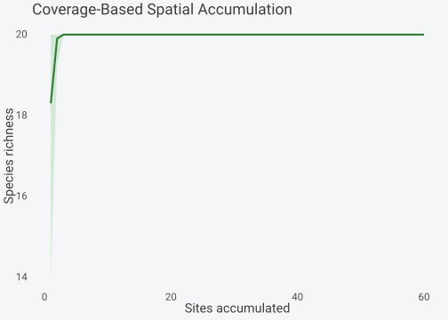

# Rarefaction and Standardization

## Overview

Comparing diversity across sites with unequal sampling effort requires
standardization. **spacc** offers three approaches:

1.  **Individual-based rarefaction**: Subsample to equal number of
    individuals

2.  **Coverage-based rarefaction**: Standardize by sample completeness

3.  **Spatial coverage tracking**: Monitor coverage along accumulation
    curves

This vignette compares these methods and provides guidance on when to
use each.

## Data setup

``` r

library(spacc)
set.seed(42)

n_sites <- 60
coords <- data.frame(x = runif(n_sites), y = runif(n_sites))

# Variable total abundances across sites (realistic uneven sampling)
lambdas <- rep(c(1, 3, 5), each = 20)
species <- matrix(0, nrow = n_sites, ncol = 20)
for (i in seq_len(n_sites)) {
  species[i, ] <- rpois(20, lambda = lambdas[i])
}
colnames(species) <- paste0("sp", 1:20)
```

## Individual-based rarefaction

The [`rarefy()`](https://gillescolling.com/spacc/reference/rarefy.md)
function subsamples curves to a common number of individuals, removing
the abundance bias:

``` r

# Rarefy to minimum observed abundance
rare <- rarefy(species)
print(rare)
#> Individual-based rarefaction
#> ---------------------------- 
#> Total individuals: 3523
#> Observed species: 20
#> Bootstrap replicates: 100
```

``` r

plot(rare)
```


You can also rarefy Hill number curves:

``` r

# Rarefy at different diversity orders
rare_q1 <- rarefy(species, q = 1)
rare_q2 <- rarefy(species, q = 2)
print(rare_q1)
#> Individual-based rarefaction (q=1)
#> ---------------------------- 
#> Total individuals: 3523
#> Observed species: 20
#> Diversity order: q=1
#> Bootstrap replicates: 100
```

[`rarefy()`](https://gillescolling.com/spacc/reference/rarefy.md)
accepts any non-negative order `q`. Orders 0, 1, and 2 use exact
estimators (Hurlbert’s expectation for richness, with the corresponding
Shannon and Simpson forms); other orders report the Hill number of order
`q`:

``` r

rare_q3 <- rarefy(species, q = 3)
rare_half <- rarefy(species, q = 0.5)
```

## Coverage-based standardization

Coverage-based rarefaction (Chao & Jost 2012) standardizes by sample
completeness rather than sample size. This is often preferred because
equal coverage means equal proportional representation of the community:

``` r

cov_result <- spaccCoverage(species, coords, n_seeds = 10, progress = FALSE)
plot(cov_result)
```



### Interpolation at fixed coverage

``` r

interp <- interpolateCoverage(cov_result, target = c(0.8, 0.9, 0.95))
print(interp)
#>         C80      C90      C95
#> 1  20.00000 20.00000 20.00000
#> 2  20.00000 20.00000 20.00000
#> 3  17.29656 18.73054 19.44753
#> 4  15.00000 15.00000 15.00000
#> 5  16.86118 18.10577 18.72807
#> 6  20.00000 20.00000 20.00000
#> 7  20.00000 20.00000 20.00000
#> 8  20.00000 20.00000 20.00000
#> 9  20.00000 20.00000 20.00000
#> 10 20.00000 20.00000 20.00000
```

### Extrapolation beyond observed

``` r

extrap <- extrapolateCoverage(cov_result, target_coverage = 0.99, q = 0)
print(extrap)
#> Coverage-based extrapolation
#> -------------------------------- 
#> Diversity order: q = 0
#> Observed coverage: 100.0%
#> Observed richness: 20.0
#> 
#> Extrapolated richness:
#>   C=99%: 19.7 (+/- 0.9)
```

## Combined Hill + Coverage analysis

The
[`spaccHillCoverage()`](https://gillescolling.com/spacc/reference/spaccHillCoverage.md)
function tracks both Hill numbers and coverage simultaneously, enabling
standardization across q orders:

``` r

hc <- spaccHillCoverage(species, coords, q = c(0, 1, 2),
                         target_coverage = 0.9,
                         n_seeds = 10, progress = FALSE)
print(hc)
#> spacc Hill + Coverage: 60 sites, 20 species, 10 seeds
#> Orders (q): 0, 1, 2
#> Mean final coverage: 1.000
#> Target coverage: 0.9
```

``` r

plot(hc, xaxis = "coverage")
```


## When to use which method

| Method | Best for | Limitation |
|----|----|----|
| Individual-based | Simple comparisons | Sensitive to abundance distribution |
| Coverage-based | Uneven sampling | Requires abundance data |
| Hill + Coverage | Multi-order standardization | Computationally heavier |

**Rules of thumb:**

- Use individual-based rarefaction when total abundances are the primary
  source of variation and you want a simple, well-understood correction.
- Use coverage-based methods when sites differ in sampling completeness
  and you want to compare at equal representativeness.
- Use Hill + Coverage when you need standardized comparisons across
  multiple diversity orders (q = 0, 1, 2) simultaneously.

## References

- Chao, A. & Jost, L. (2012). Coverage-based rarefaction and
  extrapolation: standardizing samples by completeness rather than size.
  *Ecology*, 93, 2533-2547.
- Chao, A., Gotelli, N.J., Hsieh, T.C., Sander, E.L., Ma, K.H., Colwell,
  R.K. & Ellison, A.M. (2014). Rarefaction and extrapolation with Hill
  numbers. *Ecological Monographs*, 84, 45-67.
