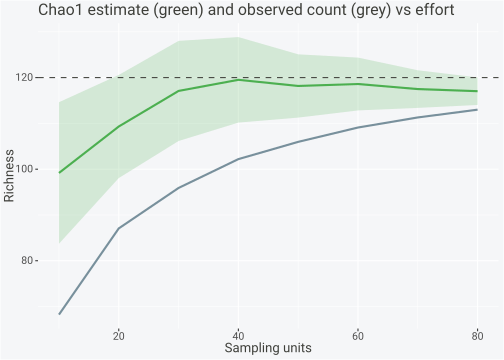
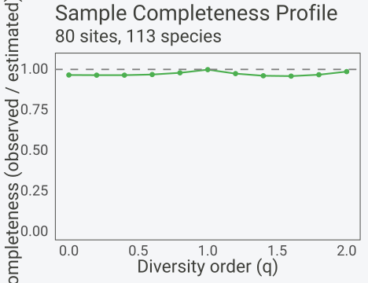

# Richness Estimation and Completeness

## Overview

Observed richness is a floor, never the truth. A survey records the
species it happens to detect, and the ones with few individuals or few
occurrences are the ones most likely to slip through. The deficit
shrinks as effort grows, yet it never reaches zero in finite samples.
**spacc** ships a family of non-parametric estimators that read the
deficit off the rare end of the frequency distribution and add an
estimate of the unseen species to the observed count.

The estimators are non-parametric in the sense that they assume no
particular shape for the underlying abundance distribution. Rather than
fitting a log-series or log-normal and reading off its tail, they
exploit a single structural fact: the species seen once or twice carry
almost all the information about the species seen zero times. A
community in which many species are singletons is a community that is
still discovering new species with every added sample, so its true
richness lies well above what has been recorded. A community with no
singletons has, in effect, been sampled to saturation, and the observed
count is close to the truth.

This vignette treats richness estimation as an algorithmic problem. It
sets out the estimator family and the rare-species logic behind it,
writes the formulas exactly as **spacc** implements them, traces how
each estimate approaches a known true richness as sampling effort
increases, covers the few tunable parameters, compares the package
estimators against `iNEXT` on identical data, and closes with
completeness profiles and a block of practical guidance. Throughout, the
data are simulated from a community with a fixed true number of species,
so every estimate can be checked against the number it is trying to
recover.

## Algorithm overview

The non-parametric family splits along the kind of data it consumes.
Abundance-based estimators work on individual counts pooled across the
survey: the input is the total number of individuals of each species.
Chao1 and ACE live here. Incidence-based estimators work on occurrence
counts: the input is the number of sampling units (sites, plots, traps)
at which each species was recorded, ignoring how many individuals were
found. Chao2, the first- and second-order jackknives, and the bootstrap
live here. The improved estimators iChao1 and iChao2 extend their Chao
counterparts, one on each side of the abundance/incidence divide.

The rare-species logic is the same on both sides. Let \\S\_{obs}\\ be
the observed species count. In abundance data, let \\f_k\\ be the number
of species represented by exactly \\k\\ individuals in the pooled
sample, so \\f_1\\ counts singletons, \\f_2\\ doubletons, \\f_3\\
tripletons, and \\f_4\\ quadrupletons. In incidence data, let \\Q_k\\ be
the number of species detected in exactly \\k\\ sampling units, so
\\Q_1\\ counts uniques (found at one site), \\Q_2\\ duplicates (found at
two sites), and so on. The number of sampling units is \\m\\. Singletons
and uniques are the key quantity. Their abundance answers a Good-Turing
question: how much probability mass sits on species not yet seen. Many
singletons mean a large unseen pool; zero singletons mean the unseen
pool is, to first order, empty.

Chao1 and Chao2 turn that intuition into a minimum-variance lower bound
on richness, built from \\f_1, f_2\\ (or \\Q_1, Q_2\\) alone. ACE takes
a coverage route: it splits species into a rare group and an abundant
group at an abundance threshold, estimates the sample coverage of the
rare group from its singleton fraction, and inflates the rare count by
the inverse of that coverage, with a further correction for how unevenly
the rare species are distributed. The jackknife estimators come from
resampling theory rather than coverage theory. They ask how the observed
count would change if sampling units were deleted one at a time, and
extrapolate the resulting bias. The first-order jackknife uses only
\\Q_1\\; the second-order form adds a \\Q_2\\ term. The bootstrap
estimator takes yet another route, summing each species’ probability of
being missed entirely across all \\m\\ units. A species present at half
the units contributes a tiny correction, while one present at a single
unit contributes most of its weight, so the bootstrap, like the Chao
bounds, draws almost all of its correction from the rare end of the
occurrence distribution.

The improved estimators address a known weakness of the original Chao
bounds. Chao1 and Chao2 use information only up to doubletons, which
makes them conservative when a sample is small enough that tripletons
and quadrupletons still carry signal. iChao1 and iChao2 add a correction
built from \\f_3, f_4\\ (respectively \\Q_3, Q_4\\) that raises the
estimate when the rare tail is heavy, and that vanishes when \\f_4 = 0\\
(respectively \\Q_4 = 0\\), at which point the improved estimator
returns exactly its Chao parent. The improved estimators are therefore
always at least as large as their standard counterparts, and the gap
between them is itself a diagnostic for how far from saturation a sample
sits.

All estimators in **spacc** return a `spacc_estimate` object carrying
the point estimate, a standard error, a 95% confidence interval, the
observed richness, and the rare-frequency counts that drove the
calculation. The Chao-family intervals are log-transformed so the lower
bound never drops below \\S\_{obs}\\, which is the correct behaviour for
a quantity that can only be underestimated.

## Data setup

The simulated community has a true richness of 120 species. Relative
abundances are log-normal, so a few species dominate and a long tail is
rare. Eighty sampling units each draw 25 individuals at random, which
leaves several true species undetected and many detected only once or
twice. The observed richness sits below 120, and the gap is what the
estimators must recover.

``` r

library(spacc)
set.seed(1)

S_true <- 120
rel <- exp(rnorm(S_true, mean = 0, sd = 1.5))
rel <- rel / sum(rel)

n_sites <- 80
species <- t(sapply(seq_len(n_sites),
                    function(i) rmultinom(1, size = 25, prob = rel)))
species <- species[, colSums(species) > 0, drop = FALSE]  # detected species
colnames(species) <- paste0("sp", seq_len(ncol(species)))
```

``` r

S_obs <- ncol(species)
ab <- colSums(species)
data.frame(S_true = S_true, S_obs = S_obs,
           f1 = sum(ab == 1), f2 = sum(ab == 2),
           f3 = sum(ab == 3), f4 = sum(ab == 4))
#>   S_true S_obs f1 f2 f3 f4
#> 1    120   113 11 15 11  8
```

The rare-frequency counts confirm the sample is informative but not
saturated: several singletons and doubletons feed the Chao bounds, and
non-zero tripletons and quadrupletons mean the improved estimators have
something to correct.

## Non-parametric richness estimators

Each estimator is a one-line call on the site-by-species matrix.
Abundance-based estimators pool the columns into total counts;
incidence-based estimators binarize first. The print method reports the
observed count, the estimate, the standard error, and the interval.

### Abundance-based: Chao1 and ACE

``` r

chao1(species)
#> Richness Estimator: chao1
#> -------------------------------- 
#> Observed species (S_obs): 113
#> Estimated richness:       117.0
#> Standard error:           3.0
#> 95% CI:                   [114.1, 127.8]
spacc::ace(species)
#> Richness Estimator: ace
#> -------------------------------- 
#> Observed species (S_obs): 113
#> Estimated richness:       119.1
#> Standard error:           37.2
#> 95% CI:                   [113.1, 369.8]
```

### Incidence-based: Chao2 and jackknife

``` r

chao2(species)
#> Richness Estimator: chao2
#> -------------------------------- 
#> Observed species (S_obs): 113
#> Estimated richness:       117.0
#> Standard error:           3.3
#> 95% CI:                   [114.0, 129.4]
jackknife(species, order = 1)
#> Richness Estimator: jackknife1
#> -------------------------------- 
#> Observed species (S_obs): 113
#> Estimated richness:       123.9
#> Standard error:           260.4
#> 95% CI:                   [113.0, 634.2]
jackknife(species, order = 2)
#> Richness Estimator: jackknife2
#> -------------------------------- 
#> Observed species (S_obs): 113
#> Estimated richness:       120.1
#> Standard error:           7.5
#> 95% CI:                   [113.0, 134.8]
```

### Bootstrap estimator

``` r

bootstrap_richness(species, n_boot = 100)
#> Richness Estimator: bootstrap
#> -------------------------------- 
#> Observed species (S_obs): 113
#> Estimated richness:       119.7
#> Standard error:           3.2
#> 95% CI:                   [113.0, 118.7]
```

### Comparison table

``` r

estimators <- list(
  chao1(species), chao2(species), spacc::ace(species),
  jackknife(species, order = 1), jackknife(species, order = 2),
  bootstrap_richness(species, n_boot = 100)
)
tab <- do.call(rbind, lapply(estimators, as.data.frame))
tab$gap_to_truth <- S_true - tab$estimate
tab
#>    estimator S_obs estimate         se    lower    upper gap_to_truth
#> 1      chao1   113 117.0333   3.002789 114.0975 127.8232    2.9666667
#> 2      chao2   113 116.9829   3.287717 113.9696 129.3604    3.0170833
#> 3        ace   113 119.1117  37.166285 113.1455 369.7607    0.8882910
#> 4 jackknife1   113 123.8625 260.367721 113.0000 634.1832   -3.8625000
#> 5 jackknife2   113 120.1476   7.470878 113.0000 134.7905   -0.1476266
#> 6  bootstrap   113 119.7154   3.345286 113.0000 117.6051    0.2846335
```

Every estimate lies above the observed count and below or near the true
120. The bootstrap and the bias-corrected Chao bounds sit lowest, the
jackknives highest, which matches the textbook ordering for a moderately
under-sampled community.

## Mathematical detail

The formulas below are the ones **spacc** evaluates, read directly from
`R/estimators.R`. Symbols are as defined above: \\S\_{obs}\\ observed
richness, \\f_k\\ abundance frequency counts, \\Q_k\\ incidence
frequency counts, and \\m\\ the number of sampling units.

### Chao1

When at least one doubleton is present, Chao1 uses the classic ratio of
squared singletons to doubletons:

\\ S\_{Chao1} = S\_{obs} + \frac{f_1^2}{2 f_2}, \qquad f_2 \> 0 . \\

When \\f_2 = 0\\ the ratio is undefined and **spacc** switches to the
bias-corrected form, which replaces the doubleton denominator with a
count-based expression:

\\ S\_{Chao1} = S\_{obs} + \frac{f_1 (f_1 - 1)}{2}, \qquad f_2 = 0 . \\

The variance follows Chao (1987). With \\f_2 \> 0\\,

\\ \widehat{\mathrm{var}} = f_2 \left\[
\frac{1}{4}\left(\frac{f_1}{f_2}\right)^2 +
\left(\frac{f_1}{f_2}\right)^3 +
\frac{1}{4}\left(\frac{f_1}{f_2}\right)^4 \right\] , \\

and the standard error is its square root. The confidence interval is
log-transformed about \\T = S\_{Chao1} - S\_{obs}\\ so that the lower
bound stays at or above \\S\_{obs}\\.

### Chao2

Chao2 is the incidence analogue. It replaces individual frequencies with
occurrence frequencies and carries a finite-sample factor \\(m-1)/m\\:

\\ S\_{Chao2} = S\_{obs} + \frac{m-1}{m}\\\frac{Q_1^2}{2 Q_2}, \qquad
Q_2 \> 0 . \\

When \\Q_2 = 0\\ the same correction structure as Chao1 applies, again
scaled by \\(m-1)/m\\:

\\ S\_{Chao2} = S\_{obs} + \frac{m-1}{m}\\\frac{Q_1 (Q_1 - 1)}{2},
\qquad Q_2 = 0 . \\

The factor \\(m-1)/m\\ tends to one as the number of sampling units
grows, so the correction matters most when \\m\\ is small.

### ACE

ACE partitions the species into a rare group, those with pooled
abundance at most the threshold \\\tau\\ (the `threshold` argument,
default 10), and an abundant group above it. Let \\S\_{rare}\\ and
\\S\_{abund}\\ be the counts in each group, \\n\_{rare}\\ the total
individuals in the rare group, and \\f_1\\ the singletons. The sample
coverage of the rare group is

\\ C\_{ACE} = 1 - \frac{f_1}{n\_{rare}} , \\

and the squared coefficient of variation of the rare abundances is

\\ \gamma^2 = \max\left( \frac{S\_{rare}}{C\_{ACE}}
\frac{\sum\_{i=1}^{\tau} i(i-1)\\ f_i}{n\_{rare}(n\_{rare} - 1)} - 1,\\
0 \right) . \\

The estimate combines the abundant count, the coverage-inflated rare
count, and a heterogeneity term:

\\ S\_{ACE} = S\_{abund} + \frac{S\_{rare}}{C\_{ACE}} +
\frac{f_1}{C\_{ACE}}\\ \gamma^2 . \\

When no species fall in the rare group, ACE returns \\S\_{obs}\\
unchanged. When the rare group is all singletons, \\C\_{ACE} \le 0\\ and
**spacc** falls back to the Chao1 bias-corrected form.

### Jackknife

The first-order jackknife adds a single \\Q_1\\ term scaled by
\\(m-1)/m\\:

\\ S\_{jack1} = S\_{obs} + Q_1 \frac{m-1}{m} . \\

The second-order jackknife adds a \\Q_2\\ term and inflates the \\Q_1\\
weight:

\\ S\_{jack2} = S\_{obs} + \frac{Q_1 (2m - 3)}{m} - \frac{Q_2 (m -
2)^2}{m(m - 1)} . \\

The jackknives are first- and second-order approximations to the bias of
\\S\_{obs}\\, and the second-order form corrects for curvature that the
first misses. The intervals are symmetric Gaussian bands truncated at
\\S\_{obs}\\ from below.

### Bootstrap

The bootstrap estimator sums each species’ probability of being absent
from all \\m\\ units. With \\p_i = Q_i / m\\ the proportion of units
occupied by species \\i\\,

\\ S\_{boot} = S\_{obs} + \sum\_{i=1}^{S\_{obs}} (1 - p_i)^{m} . \\

The standard error and interval come from `n_boot` resamples of the
units (default 200), so they are empirical rather than analytic.

### iChao1 and iChao2

The improved estimators (Chiu et al. 2014) add a correction built from
the next two frequency counts. For iChao1, with \\f_4 \> 0\\ and \\f_3
\> 0\\,

\\ S\_{iChao1} = S\_{Chao1} + \frac{f_3}{4 f_4} \max\\\left( f_1 -
\frac{f_2 f_3}{2 f_4},\\ 0 \right) . \\

For iChao2 the incidence quantities take over,

\\ S\_{iChao2} = S\_{Chao2} + \frac{Q_3}{4 Q_4} \max\\\left( Q_1 -
\frac{Q_2 Q_3}{2 Q_4},\\ 0 \right) . \\

When \\f_4 = 0\\ (respectively \\Q_4 = 0\\) the correction term is
dropped and the improved estimator returns exactly its Chao parent. The
\\\max(\cdot, 0)\\ guard keeps the correction non-negative, which is why
the improved estimates are always at least as large as the standard
ones.

``` r

r_ichao1 <- iChao1(species)
r_ichao2 <- iChao2(species)
r_ichao1
#> Richness Estimator: iChao1
#> -------------------------------- 
#> Observed species (S_obs): 113
#> Estimated richness:       117.3
#> Standard error:           3.3
#> 95% CI:                   [114.1, 129.5]
r_ichao2
#> Richness Estimator: iChao2
#> -------------------------------- 
#> Observed species (S_obs): 113
#> Estimated richness:       117.0
#> Standard error:           3.9
#> 95% CI:                   [113.8, 132.6]
```

``` r

ich <- rbind(
  as.data.frame(chao1(species)), as.data.frame(r_ichao1),
  as.data.frame(chao2(species)), as.data.frame(r_ichao2)
)
ich$gap_to_truth <- S_true - ich$estimate
ich
#>   estimator S_obs estimate       se    lower    upper gap_to_truth
#> 1     chao1   113 117.0333 3.002789 114.0975 127.8232     2.966667
#> 2    iChao1   113 117.2697 3.339807 114.1022 129.5398     2.730339
#> 3     chao2   113 116.9829 3.287717 113.9696 129.3604     3.017083
#> 4    iChao2   113 116.9829 3.854043 113.8096 132.5952     3.017083
```

The improved estimates exceed their standard counterparts by a small
margin here, which is consistent with a sample that is close to but not
at saturation. A large iChao-minus-Chao gap would flag a heavy rare tail
and a sample far from complete.

## Behaviour with sample size

The defining property of a useful richness estimator is that it climbs
toward the truth as effort grows while its standard error shrinks. The
check is direct: subsample rows of the matrix at increasing intensities,
recompute the estimate, and average over replicate subsamples to smooth
the sampling noise. Here Chao1 is tracked across eight effort levels,
thirty replicates each.

``` r

effort <- c(10, 20, 30, 40, 50, 60, 70, 80)
conv <- do.call(rbind, lapply(effort, function(k) {
  reps <- t(vapply(1:30, function(r) {
    e <- chao1(species[sample(nrow(species), k), , drop = FALSE])
    c(e$S_obs, e$estimate, e$se)
  }, numeric(3)))
  data.frame(sites = k, S_obs = mean(reps[, 1]),
             estimate = mean(reps[, 2]), se = mean(reps[, 3]))
}))
round(conv, 1)
#>   sites S_obs estimate   se
#> 1    10  68.2     99.2 15.5
#> 2    20  87.1    109.3 11.3
#> 3    30  95.9    117.1 10.9
#> 4    40 102.2    119.5  9.3
#> 5    50 106.0    118.2  6.9
#> 6    60 109.1    118.6  5.8
#> 7    70 111.3    117.5  4.1
#> 8    80 113.0    117.0  3.0
```

The observed count rises steeply and never catches the truth. The Chao1
estimate overshoots a little at low effort, where singleton noise
dominates, then settles toward 120 from above as more units accumulate.
The standard error falls monotonically across the eight levels, so the
estimate becomes both more accurate and more precise with effort.

``` r

library(ggplot2)
ggplot(conv, aes(sites)) +
  geom_ribbon(aes(ymin = estimate - se, ymax = estimate + se),
              fill = "#4CAF50", alpha = 0.2) +
  geom_line(aes(y = estimate), color = "#4CAF50", linewidth = 1) +
  geom_line(aes(y = S_obs), color = "#78909C", linewidth = 1) +
  geom_hline(yintercept = S_true, linetype = "dashed") +
  labs(x = "Sampling units", y = "Richness",
       title = "Chao1 estimate (green) and observed count (grey) vs effort") +
  theme(panel.background = element_rect(fill = "transparent"),
        plot.background = element_rect(fill = "transparent"))
```



The dashed line marks the true 120. The green band is the Chao1 estimate
plus or minus one standard error; the grey line is the observed count.
The gap between grey and dashed is the deficit the estimator exists to
close, and the green band closes most of it by the time half the units
are in.

## Tuning

Most of the estimators have no free parameters: Chao1, Chao2, iChao1,
and iChao2 are determined entirely by the frequency counts. Three
estimators expose a knob.

The ACE threshold \\\tau\\ (`threshold`, default 10) sets the abundance
boundary between the rare and abundant groups. Only the rare group
contributes to the coverage and heterogeneity correction, so \\\tau\\
controls how much of the distribution ACE treats as informative about
unseen species. The default of 10 follows Chao & Lee (1992) and works
for most samples. Raising it pulls more moderately common species into
the rare group, which can stabilise the estimate when the rare group is
otherwise tiny, at the cost of diluting the singleton signal. Lowering
it sharpens the focus on the rarest species but can leave too few rare
individuals for \\C\_{ACE}\\ to be stable.

``` r

do.call(rbind, lapply(c(5, 10, 15, 20), function(th) {
  e <- spacc::ace(species, threshold = th)
  data.frame(threshold = th, estimate = round(e$estimate, 1),
             se = round(e$se, 1))
}))
#>   threshold estimate   se
#> 1         5    117.7 19.8
#> 2        10    119.1 37.2
#> 3        15    120.0 65.5
#> 4        20    120.7 80.3
```

The jackknife order chooses between bias corrections. The first order
uses \\Q_1\\ alone and tends to under-correct in heterogeneous
communities; the second adds a \\Q_2\\ term and corrects more
aggressively, at the price of higher variance. The package default is
`order = 1`. A common selection rule moves to `order = 2` when the
first-order estimate still sits far below a more information-hungry
estimator such as Chao2 or iChao2, signalling residual bias that the
extra term can absorb.

The bootstrap `n_boot` (default 200) sets the number of unit resamples
behind the standard error and the percentile interval. The point
estimate is the closed-form sum above and does not change with it. Small
values such as 50 give a noisy interval; values of 200 or more give a
stable one. The vignette uses 100 to keep build time short, which is
adequate for illustration but light for a reported analysis.

``` r

set.seed(7)
do.call(rbind, lapply(c(50, 100, 500), function(nb) {
  e <- bootstrap_richness(species, n_boot = nb)
  data.frame(n_boot = nb, estimate = round(e$estimate, 1),
             se = round(e$se, 2))
}))
#>   n_boot estimate   se
#> 1     50    119.7 3.48
#> 2    100    119.7 2.88
#> 3    500    119.7 3.10
```

The point estimate is identical across `n_boot`, confirming that the
knob touches only the uncertainty, while the standard error settles as
the resample count rises.

## Comparison to alternatives

`iNEXT` is the standard reference implementation for asymptotic
richness. Its `ChaoRichness()` computes the same Chao1 lower bound on
pooled abundance data, so it offers a clean cross-check on identical
input. The agreement table places the **spacc** Chao1 alongside the
`iNEXT` estimate and the true richness.

``` r

cr <- iNEXT::ChaoRichness(as.numeric(colSums(species)), datatype = "abundance")
sp_c1 <- chao1(species)
data.frame(
  source = c("spacc::chao1", "iNEXT::ChaoRichness", "truth"),
  estimate = round(c(sp_c1$estimate, cr[["Estimator"]], S_true), 2),
  se = round(c(sp_c1$se, cr[["Est_s.e."]], NA), 2)
)
#>                source estimate   se
#> 1        spacc::chao1   117.03 3.00
#> 2 iNEXT::ChaoRichness   117.03 3.32
#> 3               truth   120.00   NA
```

The two Chao1 implementations agree to the displayed precision, which is
the expected result for the same estimator on the same counts. Any
residual difference would trace to interval conventions rather than the
point estimate. Both land below the true 120, the conservative-by-design
behaviour of a lower bound on a moderately incomplete sample.

## Sample completeness profile

Richness is the diversity order \\q = 0\\, where every species counts
equally and the rare tail dominates.
[`completenessProfile()`](https://gillescolling.com/spacc/reference/completenessProfile.md)
extends the completeness idea across the Hill spectrum, reporting the
ratio of observed to estimated diversity at each order:

\\ C_q = \frac{D_q^{obs}}{D_q^{est}} , \\

where \\D_q^{obs}\\ is the observed Hill number of order \\q\\ and
\\D_q^{est}\\ its estimated asymptote. Completeness near one means the
sample captures most of the true diversity at that order.

``` r

cp <- completenessProfile(species)
cp
#> Sample Completeness Profile: 80 sites, 113 species
#> ---------------------------------------- 
#>    q observed estimated completeness
#>  0.0   113.00    117.03        0.966
#>  0.2    95.34     98.84        0.965
#>  0.4    80.51     83.47        0.965
#>  0.6    68.27     70.49        0.969
#>  0.8    58.28     59.53        0.979
#>  1.0    50.20     50.28        0.998
#>  1.2    43.68     44.84        0.974
#>  1.4    38.43     39.99        0.961
#>  1.6    34.20     35.67        0.959
#>  1.8    30.77     31.82        0.967
#>  2.0    27.99     28.38        0.986
```

``` r

plot(cp) +
  theme(panel.background = element_rect(fill = "transparent"),
        plot.background = element_rect(fill = "transparent"))
```



Completeness is lowest at \\q = 0\\, where undetected rare species bite
hardest, and rises toward one as \\q\\ increases and common species,
which are detected early, take over the weighting. The profile is a
compact summary of which part of the diversity spectrum a sample
resolves well: the high-\\q\\ end here is nearly complete, while the
richness end carries the residual deficit that the non-parametric
estimators try to fill. A flat profile near one across all orders would
mean the survey is essentially complete; a profile that sags only at low
\\q\\, as here, localises the incompleteness to the rare species and
points to the \\q = 0\\ estimators as the ones that still have work to
do.

## Practical guidance

The choice of estimator depends on the data type and the rare tail. The
rules below use specific frequency counts rather than adjectives.

Use an abundance-based estimator (Chao1, ACE, iChao1) when individual
counts are trustworthy and pooling them is meaningful. Use an
incidence-based estimator (Chao2, jackknife, bootstrap, iChao2) when
only presence or absence per unit is reliable, which covers most plot,
transect, and trap surveys. Reach for the improved estimators iChao1 or
iChao2 whenever \\f_3, f_4 \> 0\\ (respectively \\Q_3, Q_4 \> 0\\): the
rare tail still carries signal, and the standard Chao bound will be
conservative. When \\f_4 = 0\\, iChao1 returns Chao1, so there is
nothing to gain by switching.

Three rules of thumb with numbers:

1.  With \\f_2 = 0\\ (no doubletons), the standard Chao1 ratio is
    undefined and **spacc** uses the bias-corrected form. Treat any
    estimate from a \\f_2 = 0\\ sample as a soft lower bound only, since
    a single observed doubleton can move it substantially.
2.  Aim for at least 20 sampling units before trusting an incidence
    estimator. The \\(m-1)/m\\ factor in Chao2 and the bias terms in the
    jackknives are unstable when \\m\\ is in single digits, and the
    convergence table above shows the estimate still drifting below \\m
    = 30\\.
3.  When the iChao-minus-Chao gap exceeds roughly 10% of \\S\_{obs}\\,
    read it as a warning that the sample is far from saturation and the
    point estimate is a weak lower bound; collect more data rather than
    report a single number.

When estimates are unreliable: a sample with \\f_1 \approx S\_{obs}\\
(almost every species a singleton) gives an enormous, badly determined
Chao1 estimate with a standard error of the same order as the estimate
itself, as the ACE row in the comparison table illustrates. The
jackknives inflate without bound in that regime. The honest report there
is the observed count plus a statement that the community is
under-sampled, not a precise-looking estimate.

``` r

data.frame(
  data_type = c("abundance", "abundance", "abundance",
                "incidence", "incidence", "incidence"),
  estimator = c("chao1", "ace", "iChao1",
                "chao2", "jackknife", "iChao2"),
  use_when = c("counts reliable, f2 > 0",
               "many rare species, heterogeneous",
               "f3, f4 > 0, sample incomplete",
               "presence/absence, m >= 20",
               "incidence, simple bias correction",
               "Q3, Q4 > 0, sample incomplete"),
  unreliable_when = c("f2 = 0", "C_ace <= 0 (all singletons)", "f4 = 0",
                      "Q2 = 0 or m < 10", "few units", "Q4 = 0")
)
#>   data_type estimator                          use_when
#> 1 abundance     chao1           counts reliable, f2 > 0
#> 2 abundance       ace  many rare species, heterogeneous
#> 3 abundance    iChao1     f3, f4 > 0, sample incomplete
#> 4 incidence     chao2         presence/absence, m >= 20
#> 5 incidence jackknife incidence, simple bias correction
#> 6 incidence    iChao2     Q3, Q4 > 0, sample incomplete
#>               unreliable_when
#> 1                      f2 = 0
#> 2 C_ace <= 0 (all singletons)
#> 3                      f4 = 0
#> 4            Q2 = 0 or m < 10
#> 5                   few units
#> 6                      Q4 = 0
```

Minimum-sample guidance follows the same logic. Abundance estimators
need enough total individuals that singletons and doubletons are
countable, on the order of a few hundred for a community of dozens of
species. Incidence estimators need on the order of 20 or more sampling
units before the finite-sample corrections settle. Below those
thresholds the estimators still return a number, but the number is
governed by sampling noise in \\f_1\\ or \\Q_1\\ rather than by the
structure of the community.

## References

- Burnham, K.P. & Overton, W.S. (1978). Estimation of the size of a
  closed population when capture probabilities vary among animals.
  *Biometrika*, 65, 625-633.
- Chao, A. (1984). Nonparametric estimation of the number of classes in
  a population. *Scandinavian Journal of Statistics*, 11, 265-270.
- Chao, A. (1987). Estimating the population size for capture-recapture
  data with unequal catchability. *Biometrics*, 43, 783-791.
- Chao, A. & Lee, S.M. (1992). Estimating the number of classes via
  sample coverage. *Journal of the American Statistical Association*,
  87, 210-217.
- Chao, A. & Jost, L. (2012). Coverage-based rarefaction and
  extrapolation: standardizing samples by completeness rather than size.
  *Ecology*, 93, 2533-2547.
- Chiu, C.H., Wang, Y.T., Walther, B.A. & Chao, A. (2014). An improved
  nonparametric lower bound of species richness via a modified
  Good-Turing frequency formula. *Biometrics*, 70, 671-682.
- Smith, E.P. & van Belle, G. (1984). Nonparametric estimation of
  species richness. *Biometrics*, 40, 119-129.
