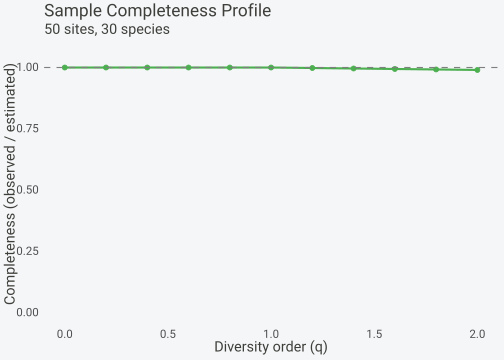

# Richness Estimation and Completeness

## Overview

How many species actually exist in a region? Observed richness always
underestimates true richness because rare species go undetected.
**spacc** provides a family of non-parametric richness estimators that
use the frequency of rare species to infer the number of unseen ones.

This vignette covers:

1.  Classical estimators (Chao1/2, ACE, jackknife, bootstrap)

2.  Improved estimators (iChao1, iChao2)

3.  Sample completeness profiles

## Data setup

``` r

library(spacc)
set.seed(42)

# 50 sites, 30 species, moderate rarity
species <- matrix(rpois(50 * 30, lambda = 2), nrow = 50)
colnames(species) <- paste0("sp", 1:30)
```

## Non-parametric richness estimators

All estimators return a `spacc_estimate` object with point estimate,
standard error, and 95% confidence interval.

### Abundance-based: Chao1 and ACE

``` r

chao1(species)
#> Richness Estimator: chao1
#> -------------------------------- 
#> Observed species (S_obs): 30
#> Estimated richness:       30.0
#> Standard error:           0.0
#> 95% CI:                   [30.0, 30.0]
spacc::ace(species)
#> Richness Estimator: ace
#> -------------------------------- 
#> Observed species (S_obs): 30
#> Estimated richness:       30.0
#> Standard error:           0.0
#> 95% CI:                   [30.0, 30.0]
```

### Incidence-based: Chao2 and jackknife

``` r

chao2(species)
#> Richness Estimator: chao2
#> -------------------------------- 
#> Observed species (S_obs): 30
#> Estimated richness:       30.0
#> Standard error:           0.0
#> 95% CI:                   [30.0, 30.0]
jackknife(species, order = 1)
#> Richness Estimator: jackknife1
#> -------------------------------- 
#> Observed species (S_obs): 30
#> Estimated richness:       30.0
#> Standard error:           0.0
#> 95% CI:                   [30.0, 30.0]
jackknife(species, order = 2)
#> Richness Estimator: jackknife2
#> -------------------------------- 
#> Observed species (S_obs): 30
#> Estimated richness:       30.0
#> Standard error:           0.0
#> 95% CI:                   [30.0, 30.0]
```

### Bootstrap estimator

``` r

bootstrap_richness(species, n_boot = 100)
#> Richness Estimator: bootstrap
#> -------------------------------- 
#> Observed species (S_obs): 30
#> Estimated richness:       30.0
#> Standard error:           0.0
#> 95% CI:                   [30.0, 30.0]
```

### Comparison table

``` r

estimators <- list(
  chao1(species),
  chao2(species),
  spacc::ace(species),
  jackknife(species, order = 1),
  jackknife(species, order = 2),
  bootstrap_richness(species, n_boot = 100)
)

do.call(rbind, lapply(estimators, as.data.frame))
#>    estimator S_obs estimate se lower upper
#> 1      chao1    30       30  0    30    30
#> 2      chao2    30       30  0    30    30
#> 3        ace    30       30  0    30    30
#> 4 jackknife1    30       30  0    30    30
#> 5 jackknife2    30       30  0    30    30
#> 6  bootstrap    30       30  0    30    30
```

## Improved Chao estimators (iChao1/iChao2)

The improved estimators (Chiu et al. 2014) use tripletons (f3) and
quadrupletons (f4) to reduce negative bias, particularly for
under-sampled communities.

``` r

r_ichao1 <- iChao1(species)
r_ichao2 <- iChao2(species)

r_ichao1
#> Richness Estimator: iChao1
#> -------------------------------- 
#> Observed species (S_obs): 30
#> Estimated richness:       30.0
#> Standard error:           0.0
#> 95% CI:                   [30.0, 30.0]
r_ichao2
#> Richness Estimator: iChao2
#> -------------------------------- 
#> Observed species (S_obs): 30
#> Estimated richness:       30.0
#> Standard error:           0.0
#> 95% CI:                   [30.0, 30.0]
```

Compare with standard Chao:

``` r

rbind(
  as.data.frame(chao1(species)),
  as.data.frame(r_ichao1),
  as.data.frame(chao2(species)),
  as.data.frame(r_ichao2)
)
#>   estimator S_obs estimate se lower upper
#> 1     chao1    30       30  0    30    30
#> 2    iChao1    30       30  0    30    30
#> 3     chao2    30       30  0    30    30
#> 4    iChao2    30       30  0    30    30
```

The iChao estimators are always \>= their standard counterparts. When f4
or Q4 = 0, they collapse to the standard Chao1/Chao2.

## Sample completeness profile

The
[`completenessProfile()`](https://gillescolling.com/spacc/reference/completenessProfile.md)
function shows how sample completeness (the proportion of the community
represented) changes with accumulation:

``` r

cp <- completenessProfile(species)
plot(cp)
```



## References

- Chao, A. (1984). Nonparametric estimation of the number of classes in
  a population. *Scandinavian Journal of Statistics*, 11, 265-270.
- Chao, A. (1987). Estimating the population size for capture-recapture
  data with unequal catchability. *Biometrics*, 43, 783-791.
- Chiu, C.H., Wang, Y.T., Walther, B.A. & Chao, A. (2014). An improved
  nonparametric lower bound of species richness via a modified
  Good-Turing frequency formula. *Biometrics*, 70, 671-682.
- Chao, A. & Lee, S.M. (1992). Estimating the number of classes via
  sample coverage. *Journal of the American Statistical Association*,
  87, 210-217.
