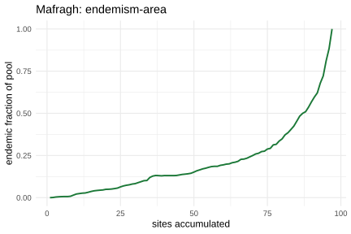
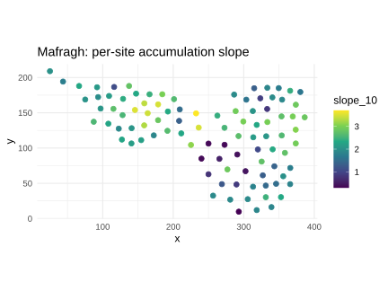

<!--
DRAFT — Methods in Ecology and Evolution, Application article (target 3,000-4,000 words).
Modelled on Hsieh, Ma & Chao (2016) iNEXT and Revell (2012) phytools.

STATUS: case study (Mafragh), benchmark, and mobr cross-check are real (Figures 1-4).
Provenance resolved: kNN/kNCN = Chiarucci et al. (2009); richness sSBR = mobr (McGlinn
et al. 2019); taxonomic/functional/phylogenetic spatially explicit rarefaction = Rarefy
(Thouverai et al. 2025). spacc is framed as complementary: scale + integrated area-based
and conservation outputs.

STRATEGIC (see A1 at end): the rarefaction core is not novel, so a high-novelty
MEE/Ecography "new method" angle is weak; JOSS (eligible ~late July) or a complementary
Applications note are the realistic homes. Remaining author tasks: A2b single-thread
benchmark, A4 anonymise for review, A5 trim and figures, ecological interpretation.
-->

# spacc: an R package for spatial species accumulation curves across diversity facets

**Gilles Colling**
Department of Botany and Biodiversity Research, University of Vienna, Austria.
ORCID: 0000-0003-3070-6066. Email: gilles.colling051@gmail.com

*Running title:* Spatial species accumulation in R
*Word count:* [FILL on finalisation]

---

## Abstract

1. The species accumulation curve is a core descriptor of how richness grows with sampling. Conventional curves accumulate samples in random or arrival order and so discard the geographic arrangement of the sites. Where sampling is spatially structured, the order in which space is traversed carries ecological information that the random curve averages away.

2. Spatially constrained rarefaction addresses this by accumulating sites in spatial order, and is implemented for taxonomic, functional, and phylogenetic diversity in existing R packages (mobr, Rarefy). `spacc` reimplements the same orderings with a parallel C++ backend and joins them to the area-based and conservation quantities built on the spatial accumulation: Hill-number and beta (turnover and nestedness) profiles, coverage standardisation, the diversity-area relationship, endemism-area curves, fragmentation- and effort-corrected species-area models, asymptotic and extreme-value extrapolation, and per-site prioritisation.

3. Curves are computed from many focal sites in parallel through a C++ (`Rcpp`/`RcppParallel`) backend, and the spread across starting points gives a percentile uncertainty band without distributional assumptions. A two-tier backend (a precomputed distance matrix for small problems, spatial trees for large ones) keeps the method usable from tens to tens of thousands of sites; at 20,000 sites a 100-seed spatial curve completes in about 3 seconds on a 32-core workstation. On a Mediterranean plant community the framework reproduces mobr's spatial rarefaction to within 0.7 species and shows functional diversity saturating after 37% of accumulated sites against 63% for taxonomic richness.

4. `spacc` is on CRAN (version 0.8.3) under an MIT licence, with worked vignettes and a documentation site. It complements the existing spatial-rarefaction packages by adding scale and an integrated set of biodiversity-scaling and conservation tools.

**Keywords:** species accumulation curve, species-area relationship, Hill numbers, beta diversity, rarefaction, spatial sampling, biodiversity, R

---

## 1. Introduction

How many species are present, and how does that number grow as more ground is covered? The species accumulation curve (SAC) answers the second question and underlies much of how richness is reported, compared, and extrapolated (Gotelli & Colwell 2001; Colwell et al. 2012). Two curves dominate practice. The sample-order ("collector") curve adds sites in the sequence they were recorded. The expected, or random, curve averages richness over many random orderings and is the form returned by widely used tools such as `vegan::specaccum` (Oksanen et al. 2022). Both treat samples as exchangeable: the position of a site on the curve depends on how many sites precede it, never on where it sits.

That assumption is convenient and, for many designs, defensible. It also discards information whenever sampling is spatially structured, which it usually is. Communities turn over across space, ranges are clumped, and survey effort is uneven. A curve that expands outward from a point traverses real spatial structure, so its shape reflects how richness, turnover, and rarity are organised geographically. The expected curve, by averaging over orderings, removes exactly that signal. This is the rationale for spatially constrained rarefaction (Chiarucci et al. 2009), which accumulates plots by spatial proximity to a focal site (the kNN ordering) or to the growing centroid of the sampled set (the kNCN ordering). Richness sSBR is implemented in mobr (McGlinn et al. 2019), and Rarefy (Thouverai et al. 2025) extends spatially explicit rarefaction to functional and phylogenetic diversity. These packages compute the rarefaction curves; what no single tool provides is a fast framework that joins spatially explicit accumulation to the area-based and conservation quantities built on it (endemism-area, fragmentation- and effort-corrected species-area models, diversity-area relationships, asymptotic and extreme-value extrapolation, and per-site prioritisation) at the scale of atlas data.

The diversity toolkit itself has grown well beyond richness. Hill numbers place richness, Shannon, and Simpson diversity on one axis indexed by an order $q$ (Jost 2007; Chao et al. 2014), and `iNEXT` standardises them by sample size or coverage (Hsieh, Ma & Chao 2016). Beta diversity is partitioned into turnover and nestedness (Baselga 2010), implemented in `betapart`. Phylogenetic and functional diversity add evolutionary or trait distance (Faith 1992). These tools are mature, but each treats accumulation, if at all, in the conventional non-spatial way, and they are distributed across packages with different data conventions.

`spacc` builds on spatially constrained rarefaction (Chiarucci et al. 2009) and adds two things to the existing tools: a parallel C++ backend that scales the orderings to tens of thousands of sites, and an integrated set of area-based and conservation-oriented relationships computed along the same spatial accumulation. It applies the kNN and kNCN orderings across the diversity facets above and returns every result as a typed object with shared `print()`, `summary()`, `plot()`, and `as.data.frame()` methods. Curves are computed from many focal sites in parallel, and the variation across focal sites supplies an uncertainty band. The method is taxon-agnostic: it requires only a site-by-species matrix and site coordinates. This paper describes the spatial-accumulation method, the package structure, performance, and a worked example, and positions `spacc` relative to existing tools.

## 2. Spatial accumulation

### 2.1 Orderings

Let $S$ sites carry coordinates $\mathbf{x}_1,\dots,\mathbf{x}_S$ and a site-by-species matrix $\mathbf{Y}$. An accumulation curve is a sequence of site indices $\pi = (\pi_1,\dots,\pi_S)$ together with the cumulative diversity after each site is added. `spacc` constructs $\pi$ from the geometry rather than at random.

Two spatial orderings are central. The **nearest-neighbour (kNN)** ordering starts at a focal site $\pi_1$ and, at each step, appends the unvisited site closest to the site just added, tracing a greedy nearest-neighbour path outward from the focus. The **nearest-centroid-neighbour (kNCN)** ordering instead appends, at each step, the unvisited site closest to the centroid of the sites already visited, so the visited set grows as a compact, roughly circular patch rather than a chain. Both orderings are those of spatially constrained rarefaction (Chiarucci et al. 2009); `spacc` reimplements them with a parallel backend and extends them beyond richness. For comparison and null modelling, `spacc` also provides random ordering (the conventional expected curve), radius-based expansion from the focus, and collector (data) order. A user-supplied ordering can be passed directly through the `order` argument, which accommodates an elevational gradient, a survey date, or any externally defined sequence.

The distinction between kNN and kNCN matters at intermediate scales. The chain that kNN follows can leave a cluster and cross a gap, briefly sampling a distant patch before returning; kNCN keeps the sampled area contiguous. The two therefore answer slightly different questions about how richness fills space, and reporting both is informative when the sampling layout is irregular.

### 2.2 Uncertainty from focal sites

A single focal site gives one curve. Because the focus is arbitrary, `spacc` draws many focal sites (the `n_seeds` argument), computes one curve per focus, and summarises the ensemble by its pointwise mean and percentile interval (by default the 2.5th and 97.5th percentiles across foci). The width of that band is itself a result: a wide band means richness accumulates very differently depending on where sampling begins, which is the signature of strong spatial structure. This resampling-over-foci approach needs no parametric assumption about the curve.

### 2.3 Implementation

Each focal site is independent, so the foci are distributed across threads with `RcppParallel`; there is no shared state between workers. Distance handling uses two tiers. For small problems the pairwise distance matrix is precomputed once and reused (selected automatically at or below 500 sites). For larger problems `spacc` builds a spatial tree (k-d tree for projected coordinates, ball tree for great-circle distance) and queries nearest neighbours on demand, avoiding the quadratic memory of a full matrix. The backend is chosen automatically by problem size and can be overridden. Under CRAN's check environment the worker count is capped at two cores. Section 5 reports timings; the tree backend computes a 20,000-site spatial curve in about 3 s, where the matrix backend exceeds available memory.

## 3. The spacc package

### 3.1 Installation

```r
install.packages("spacc")            # from CRAN
# remotes::install_github("gcol33/spacc")  # development version
```

### 3.2 Main functions

A single front-door verb, `spacc()`, builds the spatial curve; downstream verbs take that curve or the raw data and return typed objects (Table 1).

**Table 1.** Principal exported functions in `spacc`.

| Function | Purpose |
|---|---|
| `spacc()` | Spatial accumulation curve (`knn`, `kncn`, `random`, `radius`, `collector`, or user `order`) with multi-focus uncertainty |
| `extrapolate()` | Asymptotic richness from a curve (Michaelis-Menten, Lomolino, Weibull, logistic, and an extreme-value-theory model; Borda-de-Agua et al. 2025) |
| `spaccHill()` | Hill-number accumulation for orders $q = 0, 1, 2$ (Chao et al. 2014) |
| `spaccBeta()` | Beta-diversity accumulation partitioned into turnover and nestedness (Baselga 2010) |
| `spaccCoverage()` | Coverage-standardised accumulation (Chao & Jost 2012) |
| `spaccPhylo()`, `spaccFunc()` | Phylogenetic (Faith's PD, MPD, MNTD) and functional (FDis, FRic) accumulation, with Rao's quadratic entropy |
| `dar()` | Diversity-area relationship across Hill orders (Ma 2018) |
| `spaccEndemism()` | Endemism-area curve (species restricted to the accumulated area) |
| `sfar()`, `sesars()` | Fragmentation- and sampling-effort-corrected species-area models (Hanski et al. 2013) |
| `spaccMetrics()` | Per-site accumulation metrics (initial slope, half-richness, area under the curve) for spatial prioritisation |
| `zetaDiversity()`, `betaDecay()`, `ses()` | Multi-site turnover, distance-decay, and null-model standardised effect sizes |
| `rarefy()`, `compare()` | Individual-based rarefaction; statistical comparison of two curves |
| `chao1()`, `chao2()`, `ace()`, `jackknife()`, `iChao1()` | Non-parametric asymptotic richness estimators |

All curve objects share `print()`, `summary()`, `plot()`, `as.data.frame()`, and (for per-site results) `as_sf()` methods, so the analysis idiom is the same across facets, and curves combine with `c()` for overlay and comparison.

### 3.3 Workflow

```r
library(spacc)
# coords: data.frame(x, y); comm: sites-by-species matrix
sac <- spacc(comm, coords, method = "knn", n_seeds = 50)
plot(sac)                       # curve with percentile band
fit <- extrapolate(sac, model = "lomolino")
summary(fit)                    # asymptotic richness estimate
```

## 4. Beyond richness: one ordering, many facets

The value of a shared spatial ordering is that any cumulative community statistic can be tracked along it. `spaccHill()` follows effective diversity at $q = 0, 1, 2$, so the curve shows how richness, common-species diversity, and dominant-species diversity accumulate at different rates. `spaccBeta()` accumulates beta diversity and splits it into turnover (replacement) and nestedness (richness difference) following Baselga (2010), which localises the spatial scale at which composition changes. `spaccCoverage()` tracks sample coverage alongside richness (Chao & Jost 2012) so that curves from different communities can be compared at equal completeness rather than equal area. `spaccPhylo()` and `spaccFunc()` carry phylogenetic and trait distance, including an abundance-weighted Rao's quadratic entropy that accepts continuous cover or biomass.

The same machinery feeds derived spatial relationships. `dar()` fits the diversity-area relationship across Hill orders (Ma 2018), with the classical species-area relationship recovered at $q = 0$. `spaccEndemism()` tracks species confined to the accumulated area, peaking at the scale where irreplaceability concentrates. `sfar()` and `sesars()` separate the effects of habitat fragmentation and uneven survey effort from the area effect (Hanski et al. 2013). `spaccMetrics()` reduces the per-site curves to interpretable summaries (initial slope, sites to half richness, area under the curve) that map directly to spatial prioritisation. For custom indices, `spaccDiversity()` accepts any user function of the cumulative community and accumulates it along the chosen ordering.

## 5. Performance and validation

Correctness and timing were assessed on simulated landscapes (100 species, presence-absence, species clustered around random centres) at $S \in \{200, 1{,}000, 5{,}000, 20{,}000\}$ sites, with 100 seeds for `spacc` and 100 permutations for `vegan::specaccum`. Timings are medians of three runs for $S \le 1{,}000$ and single runs above, on R 4.6.0 under Windows 11 (Intel i9-14900K), with seeds distributed across 32 cores. The code is reproducible from the package.

**Correctness.** The mean of `spacc` random-order curves matches the analytical expected curve of `vegan::specaccum(method = "exact")` to within 0.52 species at $S = 200$ and 0.49 species at $S = 1{,}000$ (relative error below 0.6%), the agreement expected from Monte Carlo averaging over seeds. The Hill, beta, coverage, phylogenetic, and functional backends are checked against their defining formulae in the package test suite.

**Scaling (Table 2, Figure 1).** On the matched random-order task `spacc` is faster than `vegan::specaccum` at every size, by about 13-fold at 5,000 sites (0.09 s vs 1.17 s) and 11-fold at 20,000 sites (0.34 s vs 3.89 s). For the spatial kNN curve the two-tier backend behaves as intended: the precomputed-matrix ("exact") backend is competitive to about 1,000 sites but degrades to 11.6 s by 5,000, while the spatial-tree backend scales smoothly to 20,000 sites (3.2 s), where the matrix backend is not feasible in memory. Part of the advantage over `vegan` reflects parallel seeds across 32 cores; a single-thread comparison (AUTHOR ACTION A2b) should accompany the final version so the C++ contribution is separated from parallelism.

**Table 2.** Median wall-clock time (seconds) for a 100-seed (or 100-permutation) curve; hardware as above.

| Sites | vegan (random) | spacc (random) | spacc kNN (tree) | spacc kNN (exact) |
|---:|---:|---:|---:|---:|
| 200 | 0.03 | 0.02 | 0.02 | 0.03 |
| 1,000 | 0.22 | 0.03 | 0.05 | 0.19 |
| 5,000 | 1.17 | 0.09 | 0.32 | 11.6 |
| 20,000 | 3.89 | 0.34 | 3.24 | not feasible |

**Sensitivity.** The percentile band narrows as `n_seeds` increases and is stable beyond roughly 30-50 seeds for these landscapes [confirm with a band-width-versus-seeds figure for the final version]. As spatial clustering strengthens, the gap between the spatial (kNN/kNCN) and random curves widens, the behaviour the method is designed to expose [quantify across a clustering gradient for the final version].

## 6. Case study: a Mediterranean plant community

We illustrate the framework on the Mafragh dataset (Dray & Dufour 2007, distributed with
`ade4`): 97 vegetation sites in north-east Algeria, 56 vascular plant species with
abundances, site coordinates, four plant-trait tables, and a phylogeny for the species. The
dataset carries everything the framework needs (coordinates, abundances, traits, a tree), so
the analysis below is fully reproducible.

**Spatial versus random richness (Figure 2).** The spatial (kNN) curve accumulates more
slowly than the random curve and carries a wider band: at 30% of sites it reaches 39.6
species against 48.4 for the random curve (82%). Spatially adjacent sites share species, so
expanding outward from a focus finds fewer new species than a random draw of equal size; the
gap is the spatial-autocorrelation signal the conventional curve averages away, and it
closes only as the accumulated area covers the region.

**Cross-check against `mobr`.** On the oribatid-mite data (`vegan::mite`, 70 sites with
coordinates), `spacc`'s kNCN richness curve matches `mobr`'s spatially constrained
sample-based rarefaction (`rarefaction(method = "sSBR")`, which also uses kNCN) to within
0.65 species across all 70 steps. The two implementations compute the same spatial curve;
`spacc` reproduces the established result and then reports the additional quantities below
along the same ordering.

**Facet divergence (Figure 3).** Accumulating several facets along the same spatial ordering
shows that they fill space at different rates. Normalising each curve to its value at full
extent, functional richness (FRic) reaches 90% of its final value after 37% of sites, while
taxonomic richness needs 63% and Faith's phylogenetic diversity 64%. On this community
functional space is filled early: species added over the second half of the accumulation are
largely functionally redundant with those already present, whereas phylogenetic diversity
tracks taxonomic richness. Spatially explicit functional and phylogenetic rarefaction of this
kind is also available in `Rarefy` (Thouverai et al. 2025); the point here is that `spacc`
returns these facets together with the area-based and conservation quantities below, under
one object model and backend.

**Endemism and prioritisation (Figure 4).** The endemism-area curve traces how the fraction
of range-restricted species changes as area grows, and `spaccMetrics()` maps the per-site
initial accumulation slope, separating species-dense sites (upper-left of the study area)
from the species-poorer central valley. Ranking sites by this slope yields a spatial
prioritisation layer that a single regional richness figure cannot provide.






## 7. Discussion

`spacc` sits in a crowded, active neighbourhood and is meant to complement it. Chiarucci et al. (2009) introduced spatially constrained rarefaction and the kNN/kNCN orderings; mobr (McGlinn et al. 2019) implements richness sSBR with the MoB decomposition of diversity change; Rarefy (Thouverai et al. 2025) computes spatially explicit taxonomic, functional, and phylogenetic rarefaction curves for arbitrary indices. `spacc` does not improve on the rarefaction curves these tools provide. Its contribution is twofold: a parallel C++ backend that takes the same orderings to tens of thousands of sites (Section 5), and an integrated set of area-based and conservation quantities computed along the spatial accumulation that the rarefaction-focused packages do not include, namely endemism-area curves, the species-fragmented (SFAR) and sampling-effort-corrected (SESARS) species-area models, the diversity-area relationship, asymptotic and extreme-value extrapolation, per-site prioritisation metrics, zeta diversity, distance decay, and Moran-eigenvector partitioning, all under one object model. `vegan` provides random and collector accumulation but no spatial ordering (Oksanen et al. 2022); `iNEXT` standardises Hill numbers by size and coverage but is not spatial (Hsieh et al. 2016); `betapart` partitions beta diversity without an accumulation framework (Baselga 2010).

**Table 3.** What each tool computes along a spatial ordering. Cells reflect the packages at
the time of writing and should be re-verified against current versions before submission.

| Capability | mobr | Rarefy | spacc |
|---|:---:|:---:|:---:|
| Richness spatial rarefaction (sSBR) | yes | yes | yes |
| Functional / phylogenetic spatial rarefaction | no | yes | yes |
| MoB decomposition of diversity change | yes | no | no |
| Endemism-area curve | no | no | yes |
| Fragmentation / effort SAR (SFAR, SESARS) | no | no | yes |
| Diversity-area relationship and extrapolation (incl. EVT) | no | no | yes |
| Per-site prioritisation metrics | partial | no | yes |
| Parallel C++ backend, tens of thousands of sites | partial | no | yes |

Three features carry the contribution. The same spatial ordering drives not only the
diversity rarefaction that Rarefy and mobr also provide, but the area-based and conservation
relationships built on it, in one workflow. The focal-site ensemble supplies assumption-free
uncertainty on the curve. The C++ backend and automatic two-tier distance handling keep the
method practical at survey-to-atlas scales.

Limitations are worth stating plainly. Spatial accumulation is descriptive; it characterises how diversity fills space and does not, by itself, attribute that pattern to process. The nearest-neighbour and nearest-centroid orderings are heuristics for "expanding outward" and other sensible orderings exist; the `order` argument exists so that users are not locked into the built-in ones. Coordinates are required, and for very uneven sampling the focal-site band reflects the sampling layout as much as the ecology, which the method surfaces rather than hides. `spacc` claims neither the spatial orderings nor spatial facet rarefaction as new: kNN and kNCN are from Chiarucci et al. (2009), implemented in mobr (richness) and Rarefy (taxonomic, functional, phylogenetic). The contribution is the scale and the integration with area-based and conservation outputs, and keeping that framing explicit is what separates `spacc` from the existing tools.

Planned development includes [AUTHOR: list, e.g. additional null models for `ses()`, native handling of `sf` inputs, support objects for irregular study regions].

## 8. Data and code availability

`spacc` is available from CRAN (https://CRAN.R-project.org/package=spacc), version 0.8.3, under an MIT licence. Source code, issue tracker, and development version are at https://github.com/gcol33/spacc, with documentation at https://gillescolling.com/spacc/. All code in this paper runs against the released package; the simulated example is reproducible with the seed shown. [Archive the release at Zenodo and cite the DOI here for the submitted version.]

## Acknowledgements

[Anonymise for double-anonymous review.]

## References

Baselga, A. (2010) Partitioning the turnover and nestedness components of beta diversity. *Global Ecology and Biogeography*, 19, 134-143.

Borda-de-Agua, L., Whittaker, R.J., Cardoso, P. et al. (2025) Extreme value theory explains the topography and scaling of the species-area relationship. *Nature Communications*, 16, 5346.

Chao, A. & Jost, L. (2012) Coverage-based rarefaction and extrapolation: standardizing samples by completeness rather than size. *Ecology*, 93, 2533-2547.

Chao, A., Gotelli, N.J., Hsieh, T.C., Sander, E.L., Ma, K.H., Colwell, R.K. & Ellison, A.M. (2014) Rarefaction and extrapolation with Hill numbers: a framework for sampling and estimation in species diversity studies. *Ecological Monographs*, 84, 45-67.

Chiarucci, A., Bacaro, G., Rocchini, D., Ricotta, C., Palmer, M.W. & Scheiner, S.M. (2009) Spatially constrained rarefaction: incorporating the autocorrelated structure of biological communities into sample-based rarefaction. *Community Ecology*, 10, 209-214.

Colwell, R.K., Chao, A., Gotelli, N.J., Lin, S.-Y., Mao, C.X., Chazdon, R.L. & Longino, J.T. (2012) Models and estimators linking individual-based and sample-based rarefaction, extrapolation and comparison of assemblages. *Journal of Plant Ecology*, 5, 3-21.

Dengler, J. (2009) Which function describes the species-area relationship best? A review and empirical evaluation. *Journal of Biogeography*, 36, 728-744.

Dray, S. & Dufour, A.-B. (2007) The ade4 package: implementing the duality diagram for ecologists. *Journal of Statistical Software*, 22(4), 1-20.

Faith, D.P. (1992) Conservation evaluation and phylogenetic diversity. *Biological Conservation*, 61, 1-10.

Gotelli, N.J. & Colwell, R.K. (2001) Quantifying biodiversity: procedures and pitfalls in the measurement and comparison of species richness. *Ecology Letters*, 4, 379-391.

Hanski, I., Zurita, G.A., Bellocq, M.I. & Rybicki, J. (2013) Species-fragmented area relationship. *Proceedings of the National Academy of Sciences*, 110, 12715-12720.

Hsieh, T.C., Ma, K.H. & Chao, A. (2016) iNEXT: an R package for rarefaction and extrapolation of species diversity (Hill numbers). *Methods in Ecology and Evolution*, 7, 1451-1456.

Jost, L. (2007) Partitioning diversity into independent alpha and beta components. *Ecology*, 88, 2427-2439.

Ma, Z. (2018) Generalizing the species-area relationship with the diversity-area relationship. *Ecology and Evolution*, 8, 8645-8655.

May, F., Gerstner, K., McGlinn, D.J., Xiao, X. & Chase, J.M. (2018) mobsim: an R package for the simulation and measurement of biodiversity across spatial scales. *Methods in Ecology and Evolution*, 9, 1401-1408.

McGlinn, D.J., Xiao, X., May, F. et al. (2019) Measurement of Biodiversity (MoB): a method to separate the scale-dependent effects of species abundance distribution, density, and aggregation on diversity change. *Methods in Ecology and Evolution*, 10, 258-269. [pages to verify]

Oksanen, J., Simpson, G.L., Blanchet, F.G. et al. (2022) vegan: Community Ecology Package. R package. https://CRAN.R-project.org/package=vegan

Scheiner, S.M. (2003) Six types of species-area curves. *Global Ecology and Biogeography*, 12, 441-447.

Thouverai, E., Pavoine, S., Tordoni, E., Chiarucci, A., Ricotta, C., Rocchini, D. & Bacaro, G. (2025) Rarefy: an R package for the calculation of taxonomic, functional and phylogenetic sample-based spatially explicit rarefaction curves. *Ecological Informatics* [volume and pages to verify].

---

## Author action items (delete before submission)

- **A1 — Novelty / provenance (resolved; strategic flag).** The spatial orderings (kNN, kNCN) are Chiarucci et al. (2009). Richness sSBR is in mobr; taxonomic + functional + phylogenetic spatially explicit rarefaction is already in Rarefy (Thouverai et al. 2025), by the same group. The draft no longer claims any of these as new. The honest contribution is scale (parallel backend) plus the integrated area-based and conservation outputs (endemism-area, SFAR, SESARS, diversity-area, EVT extrapolation, per-site metrics) that the rarefaction packages do not include. STRATEGIC: this makes a high-novelty "new method" framing for MEE/Ecography unlikely; JOSS (software, eligible ~late July) or a carefully framed Applications note positioned as complementary are the realistic homes. Decide the venue before investing further effort.
- **A2 — Empirical numbers (done).** Benchmark run and inserted as Table 2 and Figure 1 (`paper/figures/benchmark.{png,svg,csv}`): `spacc` random matches vegan's exact curve to within 0.5 species; `spacc` is ~11-13x faster than `vegan::specaccum` on matched random curves; the tree backend scales to 20,000 sites where the matrix backend is infeasible.
- **A2b — Fairness refinement.** Add a single-thread comparison (so the speed gain is attributed to the C++ backend, not the 32-core parallelism), plus the band-width-vs-seeds and clustering-vs-gap sensitivity figures.
- **A3 — Real dataset (done).** The case study now uses the Mafragh Mediterranean plant data (`ade4`): 97 sites, 56 species, coordinates + traits + phylogeny, fully reproducible. Figures 2-4 and the mobr cross-check are real. Remaining: the ecological interpretation is yours; one of 56 tree tips did not match a species name (55 matched) so confirm that pairing; add a second, larger system only if a referee asks for broader generality.
- **A4 — Anonymise.** Strip author block, affiliation, ORCID, acknowledgements, and self-citations for double-anonymous review; keep a separate title page.
- **A5 — Length & figures.** Trim to 3,000-4,000 words (Application article); add Figure 1 (spatial vs random curve), Figure 2 (benchmark scaling), Figure 3 (facets panel: Hill / beta / endemism).
